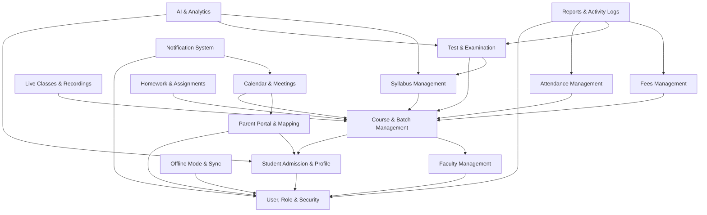

# LMS Module Dependency Map

**Project:** Learning Management System (LMS)  
**Document Type:** Dependency Map and System Interfaces  
**Date:** 29 June 2026  

This document defines the dependency architecture of the 16 LMS modules. It outlines prerequisite modules, dependents, and data interfaces for each module to ensure data integrity and Clean Architecture.

---

## 1. Visual Dependency Graph

The diagram below shows how the LMS modules depend on each other. Core security and user profiles act as foundations, course configuration forms the academic core, and analytics/reporting aggregate data from downstream modules.

---

## 2. Module Dependency Matrix

### 2.1 User, Role & Security (`user_role_security`)
* **Depends On:** None (Core foundation).
* **Required By:** All modules (for authentication and RBAC checks).
* **Data Shared / Interface:**
  - Exposes `UserSessionContext` (User ID, Roles, Permissions).
  - Exposes `OTPVerificationInterface` (to trigger and verify mobile/email OTPs).

### 2.2 Student Admission & Profile (`student_admission_profile`)
* **Depends On:** `user_role_security`.
* **Required By:** `parent_portal_mapping`, `course_batch_management`, `ai_analytics`.
* **Data Shared / Interface:**
  - Exposes `StudentID`, `StudentProfile` (Aadhaar, contact, address).
  - Triggers user login creation in `user_role_security` upon admission approval.

### 2.3 Parent Portal & Mapping (`parent_portal_mapping`)
* **Depends On:** `user_role_security`, `student_admission_profile`.
* **Required By:** `calendar_meetings`.
* **Data Shared / Interface:**
  - Maps `ParentID` to one or more `StudentID`s via `STUDENT_PARENT_LINKS` table.
  - Exposes parent contact details to the notification layer.

### 2.4 Faculty Management (`faculty_management`)
* **Depends On:** `user_role_security`.
* **Required By:** `course_batch_management`.
* **Data Shared / Interface:**
  - Exposes `FacultyID` and faculty workloads.
  - Generates faculty login credentials in `user_role_security`.

### 2.5 Course & Batch Management (`course_batch_management`)
* **Depends On:** `student_admission_profile`, `faculty_management`.
* **Required By:** `attendance_management`, `live_classes_recordings`, `syllabus_management`, `test_examination`, `homework_assignments`, `fees_management`, `calendar_meetings`.
* **Data Shared / Interface:**
  - Exposes mappings: `BatchID -> StudentID[]`, `BatchID -> SubjectID -> FacultyID`, `BatchID -> ClassroomID`.
  - Exposes academic schedules and timetables.

### 2.6 Attendance Management (`attendance_management`)
* **Depends On:** `course_batch_management`.
* **Required By:** `reports_activity_logs`.
* **Data Shared / Interface:**
  - Reads `BatchID` student rosters.
  - Saves student presence statuses per date/session.
  - Exposes attendance data for reports and parent notification triggers.

### 2.7 Live Classes & Recordings (`live_classes_recordings`)
* **Depends On:** `course_batch_management`.
* **Required By:** None.
* **Data Shared / Interface:**
  - Reads `BatchID` schedules to create online meeting links.
  - Returns participant join/exit logs mapped to `StudentID`.

### 2.8 Syllabus Management (`syllabus_management`)
* **Depends On:** `course_batch_management`.
* **Required By:** `test_examination`, `ai_analytics`.
* **Data Shared / Interface:**
  - Configures the `SyllabusTree` (Units -> Chapters -> Topics) linked to `SubjectID`.
  - Exposes topic completion percentages (`TopicProgress`) per `BatchID`.

### 2.9 Test & Examination (`test_examination`)
* **Depends On:** `course_batch_management`, `syllabus_management`.
* **Required By:** `ai_analytics`, `reports_activity_logs`.
* **Data Shared / Interface:**
  - Maps test questions to syllabus topics (`QuestionTopicMapping`) for weak topic analyses.
  - Saves exam results (`TestAttempt`, `Result`, `TestRank`) mapped to `StudentID`.

### 2.10 Homework & Assignments (`homework_assignments`)
* **Depends On:** `course_batch_management`.
* **Required By:** None.
* **Data Shared / Interface:**
  - Maps assignments to `BatchID` and `SubjectID`.
  - Records student files and marks feedback.

### 2.11 Fees Management (`fees_management`)
* **Depends On:** `course_batch_management`.
* **Required By:** `reports_activity_logs`.
* **Data Shared / Interface:**
  - Links fee structures to `CourseID` or `BatchID`.
  - Generates invoice files and payments mapped to `StudentID`.

### 2.12 Notification System (`notification_system`)
* **Depends On:** `user_role_security`, `calendar_meetings`.
* **Required By:** None.
* **Data Shared / Interface:**
  - Consumes template parameters and dispatches notifications via SMS/WhatsApp/Email.
  - Checks recipient user preferences before sending.

### 2.13 Calendar & Meetings (`calendar_meetings`)
* **Depends On:** `course_batch_management`, `parent_portal_mapping`.
* **Required By:** `notification_system`.
* **Data Shared / Interface:**
  - Maps parent-teacher meeting slots (`ParentMeeting`) using `FacultyID` and linked parent records.
  - Schedules institute-wide calendar events.

### 2.14 Offline Mode & Sync (`offline_mode_sync`)
* **Depends On:** `user_role_security`.
* **Required By:** None.
* **Data Shared / Interface:**
  - Intercepts API requests to cache data locally.
  - Pushes queued changes (attendance, marks entry) back to respective endpoints once online.

### 2.15 AI & Analytics (`ai_analytics`)
* **Depends On:** `student_admission_profile`, `test_examination`, `syllabus_management`.
* **Required By:** None.
* **Data Shared / Interface:**
  - Processes student test scores, syllabus progress, and attendance metrics.
  - Returns recommendations (`AI_RECOMMENDATIONS` table) and performance predictions.

### 2.16 Reports & Activity Logs (`reports_activity_logs`)
* **Depends On:** `user_role_security`, `attendance_management`, `test_examination`, `fees_management`.
* **Required By:** None.
* **Data Shared / Interface:**
  - Reads data from all active databases to compile PDF/Excel reports.
  - Hooks into database save/update operations to create transaction audit trails.
