# LMS Entity Relationship Diagram (ERD)

**Project:** Learning Management System (LMS)  
**Document Type:** Entity Relationship Diagram and Data Model  
**Date:** 25 June 2026  

---

## 1. ERD Overview

This ERD covers the required LMS modules:

1. User, Role and Security
2. Student Admission and Profile
3. Parent and Guardian Mapping
4. Faculty Management
5. Course, Subject and Batch Management
6. Attendance Management
7. Live Classes and Recordings
8. Syllabus and Topic Progress
9. Test and Examination Management
10. Homework and Assignment Management
11. Fees, Payments, Receipts and Invoices
12. Notifications
13. Calendar and Parent Meetings
14. Offline Sync
15. Analytics and AI Recommendations
16. Reports and Activity Logs

---

## 2. Master ERD

```mermaid
erDiagram
    USERS ||--o{ USER_ROLES : has
    ROLES ||--o{ USER_ROLES : assigned_to
    ROLES ||--o{ ROLE_PERMISSIONS : has
    PERMISSIONS ||--o{ ROLE_PERMISSIONS : included_in
    USERS ||--o{ OTP_LOGS : receives
    USERS ||--o{ LOGIN_SESSIONS : creates
    USERS ||--o{ ACTIVITY_LOGS : performs

    USERS ||--o| STUDENTS : student_account
    USERS ||--o| FACULTY : faculty_account
    USERS ||--o| PARENTS : parent_account

    STUDENTS ||--o{ STUDENT_ADDRESSES : has
    STUDENTS ||--o{ STUDENT_DOCUMENTS : uploads
    STUDENTS ||--o{ EMERGENCY_CONTACTS : has
    STUDENTS ||--o{ ADMISSIONS : admitted_by
    STUDENTS ||--o{ STUDENT_PARENT_LINKS : linked_to
    PARENTS ||--o{ STUDENT_PARENT_LINKS : linked_to

    COURSES ||--o{ SUBJECTS : contains
    COURSES ||--o{ BATCHES : has
    SUBJECTS ||--o{ BATCH_SUBJECTS : mapped_to
    BATCHES ||--o{ BATCH_SUBJECTS : contains
    CLASSROOMS ||--o{ BATCH_SCHEDULES : allocated_to
    BATCHES ||--o{ BATCH_SCHEDULES : has
    FACULTY ||--o{ FACULTY_ASSIGNMENTS : assigned
    BATCHES ||--o{ FACULTY_ASSIGNMENTS : has
    SUBJECTS ||--o{ FACULTY_ASSIGNMENTS : taught_for
    STUDENTS ||--o{ STUDENT_BATCHES : enrolled_in
    BATCHES ||--o{ STUDENT_BATCHES : contains

    BATCHES ||--o{ ATTENDANCE_SESSIONS : has
    SUBJECTS ||--o{ ATTENDANCE_SESSIONS : for
    FACULTY ||--o{ ATTENDANCE_SESSIONS : created_by
    ATTENDANCE_SESSIONS ||--o{ ATTENDANCE_RECORDS : contains
    STUDENTS ||--o{ ATTENDANCE_RECORDS : marked_for
    USERS ||--o{ ATTENDANCE_RECORDS : marked_by
    ATTENDANCE_SESSIONS ||--o{ QR_ATTENDANCE_TOKENS : generates
    STUDENTS ||--o{ QR_ATTENDANCE_SCANS : scans
    QR_ATTENDANCE_TOKENS ||--o{ QR_ATTENDANCE_SCANS : used_in

    BATCHES ||--o{ LIVE_CLASSES : scheduled_for
    SUBJECTS ||--o{ LIVE_CLASSES : for
    FACULTY ||--o{ LIVE_CLASSES : hosted_by
    LIVE_CLASSES ||--o{ LECTURE_RECORDINGS : has

    SUBJECTS ||--o{ SYLLABUS_UNITS : has
    SYLLABUS_UNITS ||--o{ CHAPTERS : has
    CHAPTERS ||--o{ TOPICS : contains
    TOPICS ||--o{ TOPIC_PROGRESS : tracked_in
    BATCHES ||--o{ TOPIC_PROGRESS : for
    FACULTY ||--o{ TOPIC_PROGRESS : updated_by

    COURSES ||--o{ TESTS : has
    BATCHES ||--o{ TESTS : assigned_to
    SUBJECTS ||--o{ TESTS : for
    FACULTY ||--o{ TESTS : created_by
    TESTS ||--o{ TEST_SECTIONS : has
    TEST_SECTIONS ||--o{ QUESTIONS : contains
    QUESTIONS ||--o{ QUESTION_OPTIONS : has
    QUESTIONS ||--o{ QUESTION_TOPIC_MAPPINGS : mapped_to
    TOPICS ||--o{ QUESTION_TOPIC_MAPPINGS : identifies
    TESTS ||--o{ TEST_ATTEMPTS : attempted_in
    STUDENTS ||--o{ TEST_ATTEMPTS : attempts
    TEST_ATTEMPTS ||--o{ STUDENT_ANSWERS : contains
    QUESTIONS ||--o{ STUDENT_ANSWERS : answered_for
    QUESTION_OPTIONS ||--o{ STUDENT_ANSWERS : selected_option
    TEST_ATTEMPTS ||--o| RESULTS : generates
    TESTS ||--o{ TEST_RANKS : ranks
    STUDENTS ||--o{ TEST_RANKS : receives
    TESTS ||--o{ OMR_UPLOADS : has
    STUDENTS ||--o{ OMR_UPLOADS : uploaded_for

    FACULTY ||--o{ HOMEWORK : creates
    BATCHES ||--o{ HOMEWORK : assigned_to
    SUBJECTS ||--o{ HOMEWORK : for
    HOMEWORK ||--o{ HOMEWORK_FILES : includes
    HOMEWORK ||--o{ HOMEWORK_SUBMISSIONS : receives
    STUDENTS ||--o{ HOMEWORK_SUBMISSIONS : submits
    HOMEWORK_SUBMISSIONS ||--o{ SUBMISSION_FEEDBACK : reviewed_with
    FACULTY ||--o{ SUBMISSION_FEEDBACK : reviewed_by

    COURSES ||--o{ FEE_STRUCTURES : has
    BATCHES ||--o{ FEE_STRUCTURES : may_have
    FEE_STRUCTURES ||--o{ FEE_INSTALLMENTS : contains
    STUDENTS ||--o{ FEE_ASSIGNMENTS : assigned
    FEE_STRUCTURES ||--o{ FEE_ASSIGNMENTS : applied_as
    FEE_ASSIGNMENTS ||--o{ PAYMENTS : paid_against
    PAYMENTS ||--o| RECEIPTS : generates
    PAYMENTS ||--o| INVOICES : may_generate
    FEE_ASSIGNMENTS ||--o{ DISCOUNTS : may_have

    USERS ||--o{ NOTIFICATIONS : receives
    NOTIFICATION_TEMPLATES ||--o{ NOTIFICATIONS : uses
    NOTIFICATIONS ||--o{ NOTIFICATION_DELIVERY_LOGS : delivery_status
    USERS ||--o{ USER_NOTIFICATION_PREFERENCES : configures

    CALENDAR_EVENTS ||--o{ NOTIFICATIONS : triggers
    CALENDAR_EVENTS ||--o{ PARENT_MEETINGS : may_create
    PARENTS ||--o{ PARENT_MEETING_ATTENDEES : attends
    STUDENTS ||--o{ PARENT_MEETING_ATTENDEES : related_student
    PARENT_MEETINGS ||--o{ PARENT_MEETING_ATTENDEES : has

    USERS ||--o{ OFFLINE_SYNC_RECORDS : owns
    OFFLINE_SYNC_RECORDS ||--o{ OFFLINE_SYNC_CONFLICTS : may_have

    STUDENTS ||--o{ STUDENT_PERFORMANCE_METRICS : has
    STUDENTS ||--o{ WEAK_TOPIC_ANALYSIS : has
    TOPICS ||--o{ WEAK_TOPIC_ANALYSIS : analyzed_for
    STUDENTS ||--o{ AI_PREDICTIONS : has
    STUDENTS ||--o{ AI_RECOMMENDATIONS : receives
    USERS ||--o{ CHATBOT_LOGS : asks
```

---

## 3. User, Role and Security ERD

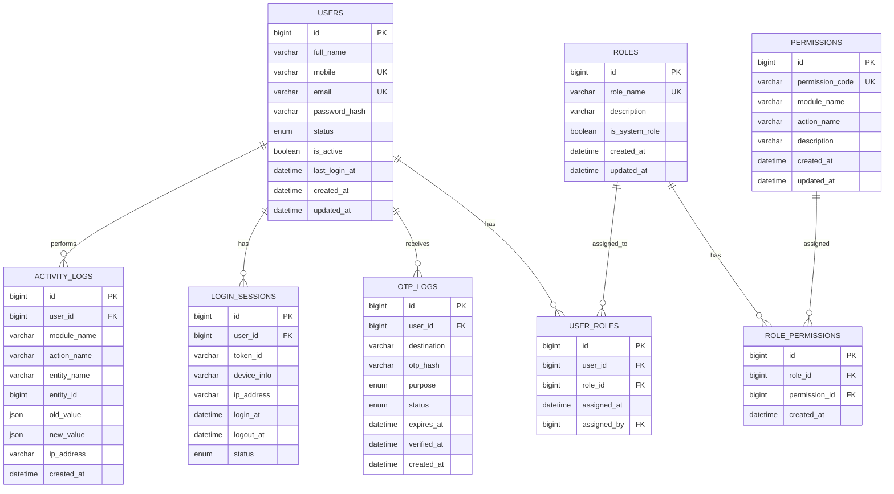

### Notes

- `USERS` is the common login table for Admin, Faculty, Student and Parent.
- A user can have multiple roles if required.
- Permissions should control module-level and action-level access.
- OTP records should store OTP hash, not plain OTP.
- Activity logs should be generated for important actions.

---

## 4. Student, Admission, Parent and Documents ERD

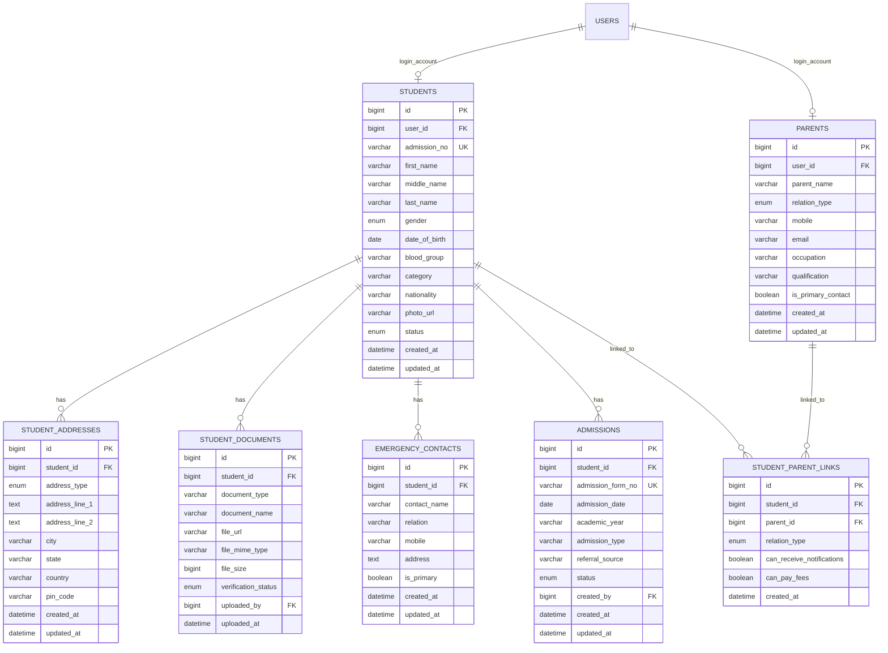

### Important Relationships

| Relationship | Description |
|---|---|
| User to Student | One user account may be linked to one student profile. |
| User to Parent | One user account may be linked to one parent profile. |
| Student to Parent | Many-to-many using `STUDENT_PARENT_LINKS`. |
| Student to Documents | One student can have multiple uploaded documents. |
| Student to Address | One student can have current/permanent addresses. |

---

## 5. Faculty, Course, Subject, Batch and Classroom ERD

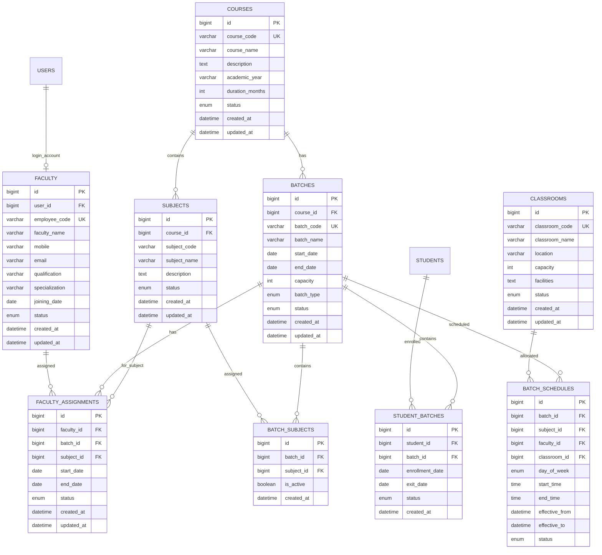

### Important Constraints

1. A faculty member should not be assigned to two classes at the same time.
2. A classroom should not be allocated to two batches at the same time.
3. A student may be transferred from one batch to another using `STUDENT_BATCHES` history.
4. Subject-wise batch creation is supported through `BATCH_SUBJECTS`.

---

## 6. Attendance ERD

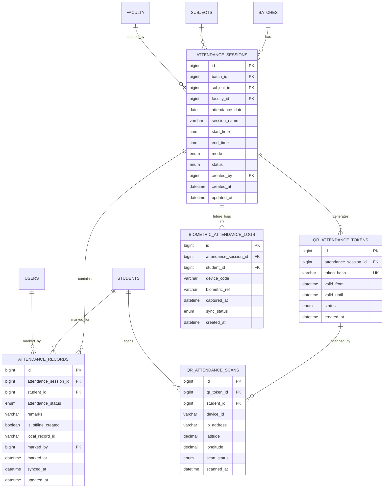

### Attendance Status Values

| Value | Description |
|---|---|
| PRESENT | Student attended the class. |
| ABSENT | Student was absent. |
| LATE | Student joined late. |
| HALF_DAY | Student attended partial session. |
| LEAVE | Approved leave. |

---

## 7. Live Class and Recording ERD

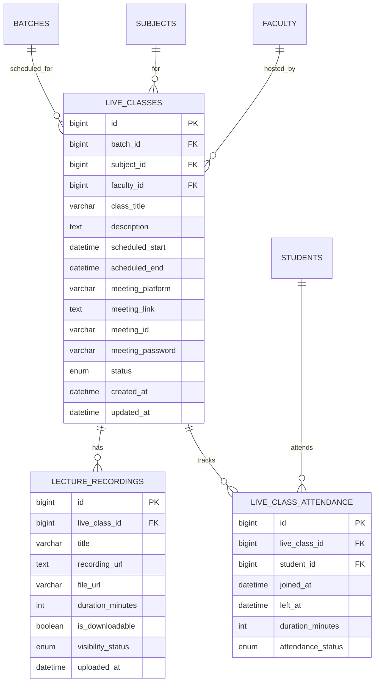

---

## 8. Syllabus Management ERD

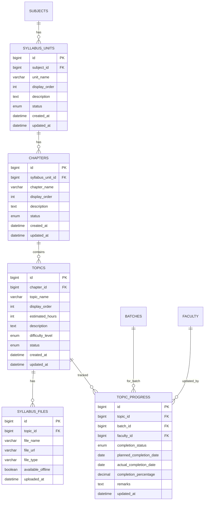

---

## 9. Test and Examination ERD

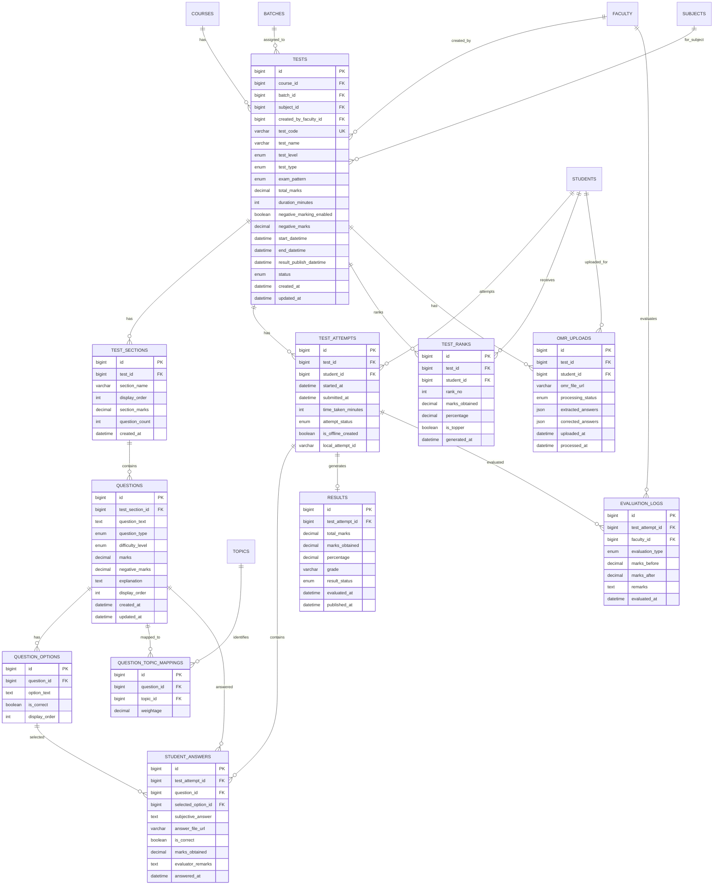

### Test Level Values

| Level | Meaning |
|---|---|
| PRIMARY | Basic tests and topic-wise tests. |
| INTERMEDIATE | Unit tests and subject tests. |
| ADVANCED | Full syllabus mocks and competitive exam pattern tests. |

---

## 10. Homework and Assignment ERD

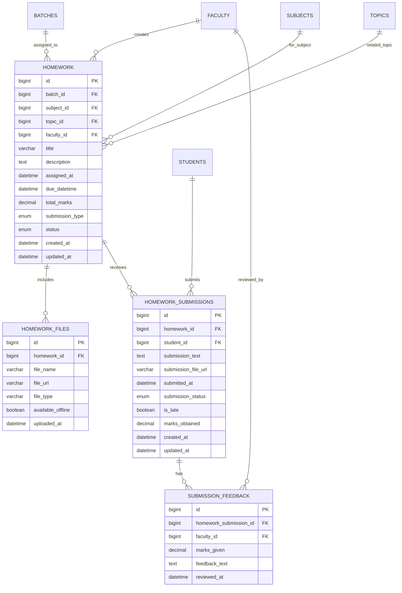

---

## 11. Fees, Payments, Receipts and Invoice ERD

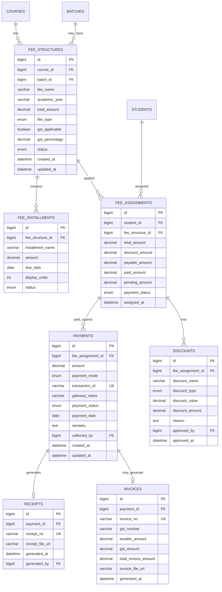

### Fees Rules

1. `FEE_ASSIGNMENTS.pending_amount = payable_amount - paid_amount`.
2. Partial payment is supported through multiple `PAYMENTS` against one `FEE_ASSIGNMENT`.
3. Receipt is generated after successful payment.
4. Invoice is optional and generated only when GST is applicable.

---

## 12. Notification ERD

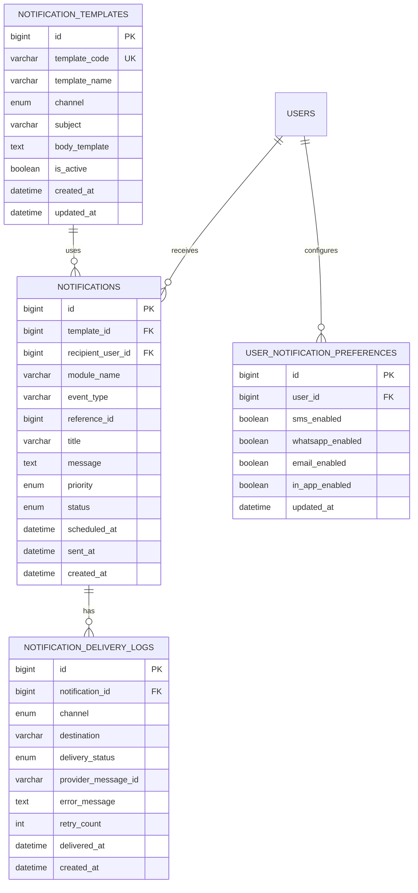

---

## 13. Calendar and Parent Meeting ERD

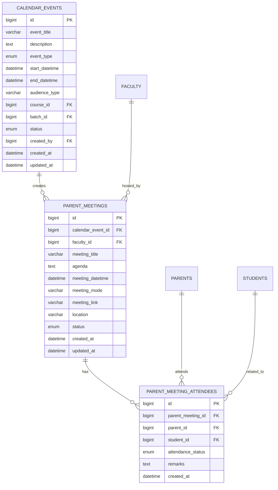

---

## 14. Offline Sync ERD

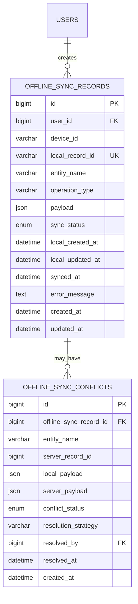

### Offline Sync Status Values

| Status | Meaning |
|---|---|
| PENDING | Saved locally and waiting for sync. |
| SYNCED | Successfully synced to server. |
| FAILED | Sync failed due to validation/network/server issue. |
| CONFLICT | Conflict found between local and server data. |
| RESOLVED | Conflict resolved manually or automatically. |

---

## 15. Analytics and AI ERD

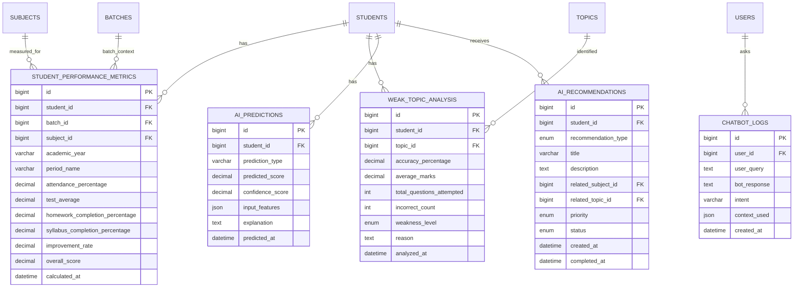

---

## 16. Reports ERD

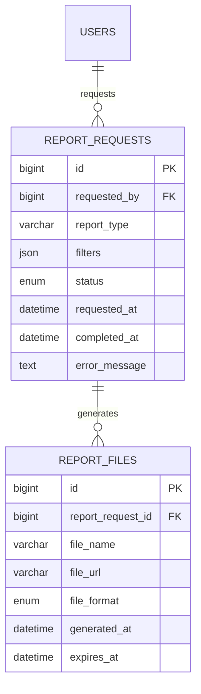

---

## 17. Recommended Unique Keys and Indexes

| Table | Recommended Unique / Index |
|---|---|
| USERS | `mobile`, `email` |
| STUDENTS | `admission_no` |
| FACULTY | `employee_code` |
| COURSES | `course_code` |
| BATCHES | `batch_code` |
| ATTENDANCE_RECORDS | `attendance_session_id + student_id` |
| QR_ATTENDANCE_TOKENS | `token_hash` |
| TESTS | `test_code` |
| TEST_ATTEMPTS | `test_id + student_id + attempt_no` if multiple attempts are allowed |
| RESULTS | `test_attempt_id` |
| TEST_RANKS | `test_id + student_id` |
| FEE_ASSIGNMENTS | `student_id + fee_structure_id` |
| PAYMENTS | `transaction_id` |
| RECEIPTS | `receipt_no` |
| INVOICES | `invoice_no` |
| OFFLINE_SYNC_RECORDS | `local_record_id` |

---

## 18. Key Cardinality Summary

| Relationship | Cardinality |
|---|---|
| User to Roles | Many-to-many |
| User to Student | One-to-one optional |
| User to Faculty | One-to-one optional |
| User to Parent | One-to-one optional |
| Student to Parent | Many-to-many |
| Course to Subject | One-to-many |
| Course to Batch | One-to-many |
| Batch to Student | Many-to-many |
| Batch to Faculty | Many-to-many through subject assignment |
| Batch to Attendance Session | One-to-many |
| Attendance Session to Attendance Records | One-to-many |
| Subject to Syllabus Units | One-to-many |
| Syllabus Unit to Chapters | One-to-many |
| Chapter to Topics | One-to-many |
| Test to Questions | One-to-many through test sections |
| Student to Test Attempts | One-to-many |
| Test Attempt to Result | One-to-one |
| Fee Structure to Fee Assignments | One-to-many |
| Fee Assignment to Payments | One-to-many |
| Payment to Receipt | One-to-one |
| Notification to Delivery Logs | One-to-many |

---

## 19. Implementation Notes

1. Use `created_at`, `updated_at`, and optionally `deleted_at` in most tables.
2. Use soft delete for students, faculty, courses, batches, tests, and fee structures.
3. Store uploaded files in object storage or secure file storage; keep only file URLs and metadata in DB.
4. For offline mode, every offline-created record should include:
   - `local_record_id`
   - `device_id`
   - `is_offline_created`
   - `synced_at`
   - `sync_status`
5. For reports, generate large reports asynchronously and store output in `REPORT_FILES`.
6. For AI, keep explainable outputs in `AI_PREDICTIONS.explanation` and `AI_RECOMMENDATIONS.description`.
7. For security, all sensitive access should be checked using role permissions and entity ownership.

---

## 20. Suggested Database Naming Convention

| Item | Convention | Example |
|---|---|---|
| Table names | plural snake_case | `student_documents` |
| Primary key | `id` | `id` |
| Foreign key | singular table name + `_id` | `student_id` |
| Boolean fields | `is_`, `has_`, `can_` prefix | `is_active` |
| Enum fields | descriptive name | `payment_status` |
| Date-time fields | suffix `_at` | `created_at` |
| Date fields | suffix `_date` | `admission_date` |

---

## 21. Conclusion

This ERD provides the complete database structure for the LMS FDD. It supports student management, attendance, batches, faculty, live classes, syllabus, tests, homework, fees, notifications, calendar, offline sync, AI analytics, reports, and security.

The ERD can be used by developers to create database migrations in Laravel, Node.js/NestJS, MySQL, or PostgreSQL.

