# Functional Design Document (FDD)
# Learning Management System (LMS)

**Document Version:** 1.0  
**Prepared For:** LMS / Coaching Institute / School Management Platform  
**Date:** 25 June 2026  
**Suggested Platforms:** Web App, Progressive Web App (PWA), Mobile App  

---

## 1. Purpose

This Functional Design Document (FDD) defines the functional scope, modules, user roles, workflows, data requirements, integrations, offline behavior, analytics, AI features, reports, and security design for a Learning Management System (LMS).

The LMS will support student lifecycle management, attendance, courses and batches, live classes, syllabus tracking, tests and examinations, fees, homework, notifications, parent portal, offline data capture, AI-based performance insights, and administrative reporting.

---

## 2. Objectives

The key objectives of the LMS are:

1. Digitize student admission, academic, attendance, fees, and exam records.
2. Enable faculty to manage attendance, notes, tests, marks, assignments, and batch progress.
3. Provide students with access to classes, recorded lectures, syllabus, homework, tests, marks, and performance analytics.
4. Provide parents with visibility into attendance, marks, homework, fees, report cards, and important notifications.
5. Enable offline-first functionality for critical academic activities such as attendance and marks entry.
6. Provide analytics and AI-driven insights for student improvement, weak-topic detection, and performance prediction.
7. Support SMS, WhatsApp, and Email notifications.
8. Maintain secure role-based access for Admin, Faculty, Student, and Parent users.

---

## 3. Scope

### 3.1 In Scope

The following modules are included:

1. Student Management
2. Attendance Management
3. Course and Batch Management
4. Live Classes
5. Syllabus Management
6. Test and Examination Module
7. Analytics and Performance
8. Parent Portal
9. Fees Management
10. Homework and Assignment Module
11. Notification System
12. Calendar Module
13. Offline Mode / PWA Support
14. AI Features
15. Faculty Module
16. Admin Dashboard
17. Reports
18. Security and Access Control
19. Backup and Restore
20. Activity Logs

### 3.2 Future Scope

1. Biometric attendance integration
2. Advanced AI proctoring
3. LMS marketplace for courses
4. Multi-branch/franchise management
5. Native mobile applications with SQLite offline database
6. Advanced ERP integration
7. Automated timetable optimization
8. AI-based question paper generation

---

## 4. User Roles

| Role | Description |
|---|---|
| Admin | Manages the complete LMS including students, faculty, parents, courses, batches, tests, fees, reports, notifications, and analytics. |
| Faculty | Manages assigned batches, attendance, syllabus progress, notes, homework, tests, marks, and student performance. |
| Student | Views profile, attendance, classes, notes, homework, tests, marks, reports, notifications, and performance analytics. |
| Parent | Views child attendance, marks, homework, fees status, report cards, and receives notifications. |
| System | Handles automation such as reminders, notifications, offline sync, AI analysis, backups, and report generation. |

Optional future roles:

| Optional Role | Description |
|---|---|
| Super Admin | Manages multiple institutes/branches and platform-level settings. |
| Accountant | Manages fees, receipts, invoices, refunds, and financial reports. |
| Front Office / Counselor | Handles inquiries, admissions, follow-ups, and student registration. |

---

## 5. High-Level System Architecture

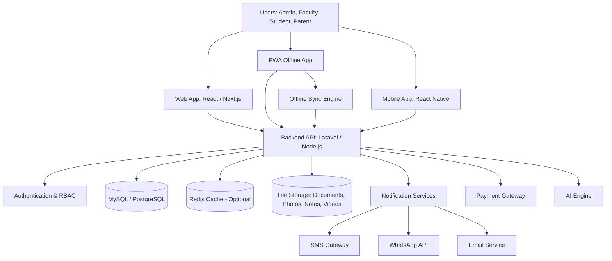

---

## 6. Overall LMS Workflow

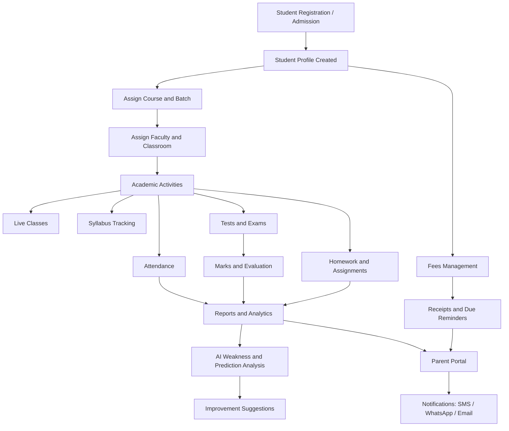

---

## 7. Role-Based Functional Diagrams

### 7.1 Admin Role Diagram

```mermaid
flowchart TD
    A[Admin Login] --> B[Admin Dashboard]
    B --> C[Manage Students]
    B --> D[Manage Faculty]
    B --> E[Manage Parents]
    B --> F[Manage Courses and Batches]
    B --> G[Manage Attendance]
    B --> H[Manage Tests and Exams]
    B --> I[Manage Fees]
    B --> J[Manage Notifications]
    B --> K[Manage Calendar]
    B --> L[Generate Reports]
    B --> M[View Analytics]
    B --> N[System Settings]

    C --> C1[Registration]
    C --> C2[Admission Form]
    C --> C3[Profile and Documents]

    F --> F1[Create Batch]
    F --> F2[Assign Subject]
    F --> F3[Assign Faculty]
    F --> F4[Allocate Classroom]

    H --> H1[Test Phases]
    H --> H2[Question Bank]
    H --> H3[Evaluation]
    H --> H4[Rank and Results]

    I --> I1[Fee Collection]
    I --> I2[Pending Fees]
    I --> I3[Receipts]
    I --> I4[GST Invoice Optional]

    L --> L1[Student Report]
    L --> L2[Attendance Report]
    L --> L3[Fee Report]
    L --> L4[Batch Report]
    L --> L5[Yearly Performance]
```

### 7.2 Faculty Role Diagram

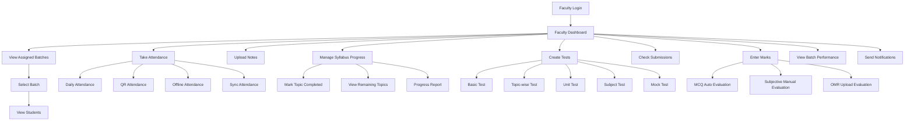

### 7.3 Student Role Diagram

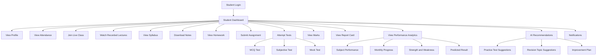

### 7.4 Parent Role Diagram

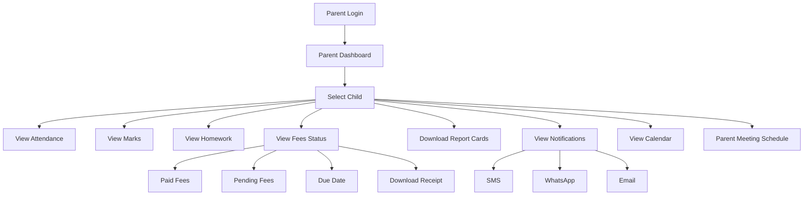

### 7.5 System Automation Role Diagram

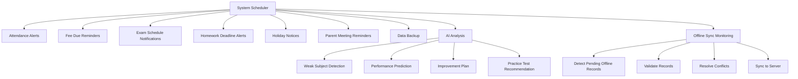

---

## 8. Module 1: Student Management

### 8.1 Purpose

The Student Management module manages the complete student lifecycle from registration to admission, academic profile creation, batch allocation, parent details, emergency contact, address, documents, and photo upload.

### 8.2 Functional Requirements

| ID | Requirement | Priority |
|---|---|---|
| SM-01 | Admin can register a new student. | High |
| SM-02 | Admin can create and submit an admission form. | High |
| SM-03 | System generates a unique Student ID / Admission Number. | High |
| SM-04 | Admin can upload student photo. | High |
| SM-05 | Admin can add parent/guardian details. | High |
| SM-06 | Admin can add emergency contact details. | High |
| SM-07 | Admin can maintain permanent and current address. | High |
| SM-08 | Admin can upload student documents such as Aadhaar, birth certificate, previous marksheet, transfer certificate, etc. | High |
| SM-09 | Admin can assign course, subject, and batch to student. | High |
| SM-10 | Admin can edit, archive, or deactivate student profile. | Medium |
| SM-11 | Student and Parent can view profile in read-only mode. | Medium |

### 8.3 Student Registration Workflow

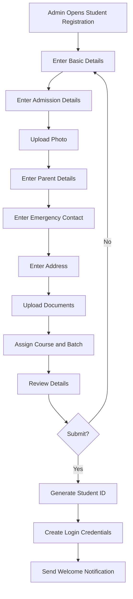

### 8.4 Main Data Fields

| Section | Fields |
|---|---|
| Basic Details | Student ID, first name, middle name, last name, gender, DOB, blood group, category, religion, nationality |
| Contact Details | Mobile number, alternate mobile, email |
| Admission Details | Admission date, admission number, course, batch, academic year, referral source |
| Parent Details | Father name, mother name, guardian name, occupation, mobile, email |
| Emergency Contact | Contact person, relation, mobile number, address |
| Address | Current address, permanent address, city, state, PIN code, country |
| Documents | Photo, ID proof, marksheets, certificates, admission form, custom documents |

### 8.5 Validation Rules

1. Student name, mobile number, admission date, course, and batch are mandatory.
2. Mobile number must be valid as per country format.
3. Email must be valid if provided.
4. Admission number must be unique.
5. Uploaded documents should follow allowed file types: PDF, JPG, JPEG, PNG.
6. Maximum file size should be configurable by Admin.

---

## 9. Module 2: Attendance Management

### 9.1 Purpose

The Attendance Management module records daily attendance, QR code attendance, absent student lists, and monthly attendance reports. It must support offline attendance capture and automatic sync when the internet returns.

### 9.2 Functional Requirements

| ID | Requirement | Priority |
|---|---|---|
| AT-01 | Faculty can mark daily attendance for assigned batches. | High |
| AT-02 | Admin can view and edit attendance records based on permission. | High |
| AT-03 | Faculty can mark Present, Absent, Late, Half Day, or Leave. | High |
| AT-04 | System can generate absent student list. | High |
| AT-05 | System can send absent notification to parents. | High |
| AT-06 | System supports QR code attendance. | High |
| AT-07 | Attendance works offline through PWA. | High |
| AT-08 | Attendance syncs automatically when internet is available. | High |
| AT-09 | System generates monthly attendance report. | High |
| AT-10 | Biometric attendance integration is supported as future enhancement. | Future |

### 9.3 Attendance Workflow

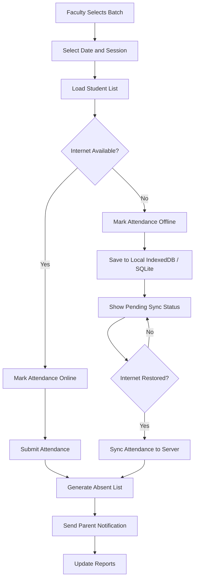

### 9.4 QR Attendance Workflow

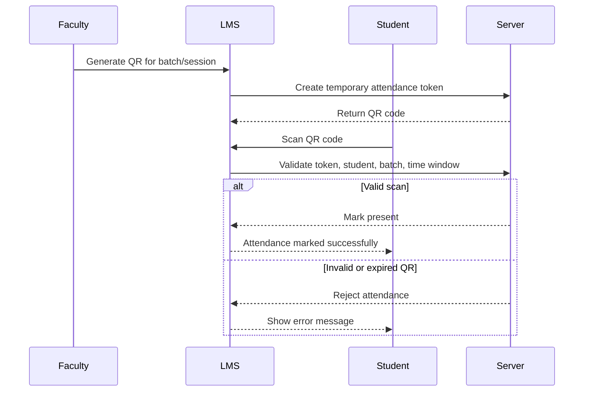

### 9.5 Attendance Rules

1. Attendance should be unique per student, date, batch, subject, and session.
2. Faculty can edit attendance only within a configurable time window unless Admin grants permission.
3. QR code should expire after a configurable time, e.g., 2 to 10 minutes.
4. Offline attendance should show a clear pending sync indicator.
5. Conflict resolution must handle duplicate or edited attendance records.

---

## 10. Module 3: Course and Batch Management

### 10.1 Purpose

This module manages courses, subjects, multiple batches, batch timings, faculty assignments, and classroom allocation.

### 10.2 Functional Requirements

| ID | Requirement | Priority |
|---|---|---|
| CB-01 | Admin can create courses. | High |
| CB-02 | Admin can create subjects under a course. | High |
| CB-03 | Admin can create multiple batches. | High |
| CB-04 | Admin can create subject-wise batches. | High |
| CB-05 | Admin can define batch timing. | High |
| CB-06 | Admin can assign faculty to batch/subject. | High |
| CB-07 | Admin can allocate classrooms. | Medium |
| CB-08 | Admin can transfer students between batches. | Medium |
| CB-09 | System prevents faculty/classroom time conflicts. | High |

### 10.3 Course and Batch Workflow

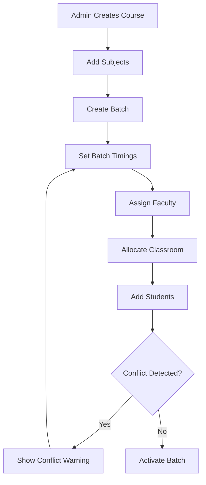

### 10.4 Batch Data Fields

| Entity | Fields |
|---|---|
| Course | Course name, description, duration, academic year, status |
| Subject | Subject name, subject code, course, description, status |
| Batch | Batch name, course, subject, start date, end date, timing, capacity, status |
| Faculty Assignment | Faculty, batch, subject, start date, end date |
| Classroom | Classroom name, capacity, location, available equipment |

---

## 11. Module 4: Live Classes

### 11.1 Purpose

The Live Classes module allows institutes to schedule online live classes, store meeting links, upload recorded lectures, send notifications, and manage class schedules.

### 11.2 Functional Requirements

| ID | Requirement | Priority |
|---|---|---|
| LC-01 | Admin/Faculty can schedule live classes. | High |
| LC-02 | Faculty can add meeting links. | High |
| LC-03 | Students can view upcoming classes. | High |
| LC-04 | Students can join live classes from dashboard. | High |
| LC-05 | Faculty can upload recorded lecture links/files. | High |
| LC-06 | System sends class notifications. | High |
| LC-07 | System maintains class schedule history. | Medium |
| LC-08 | Class recordings can be restricted by batch/subject. | High |

### 11.3 Live Class Workflow

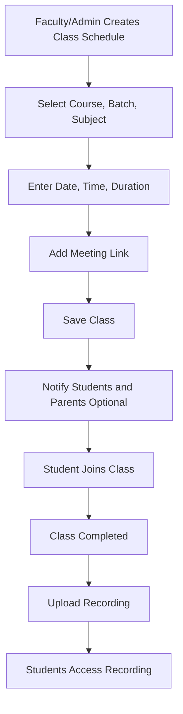

### 11.4 Meeting Integration Options

1. Zoom meeting link
2. Google Meet link
3. Microsoft Teams link
4. Custom video platform URL
5. Uploaded video file or video streaming link

---

## 12. Module 5: Syllabus Management

### 12.1 Purpose

The Syllabus Management module allows subject-wise syllabus creation, topic-level progress tracking, remaining topic visibility, and faculty progress monitoring.

### 12.2 Functional Requirements

| ID | Requirement | Priority |
|---|---|---|
| SY-01 | Admin can create subject-wise syllabus. | High |
| SY-02 | Admin/Faculty can define units, chapters, and topics. | High |
| SY-03 | Faculty can mark topics as completed. | High |
| SY-04 | System tracks remaining topics. | High |
| SY-05 | Admin can view faculty progress tracking. | High |
| SY-06 | Students can view syllabus and completed topics. | Medium |
| SY-07 | Syllabus should be accessible offline. | High |

### 12.3 Syllabus Progress Workflow

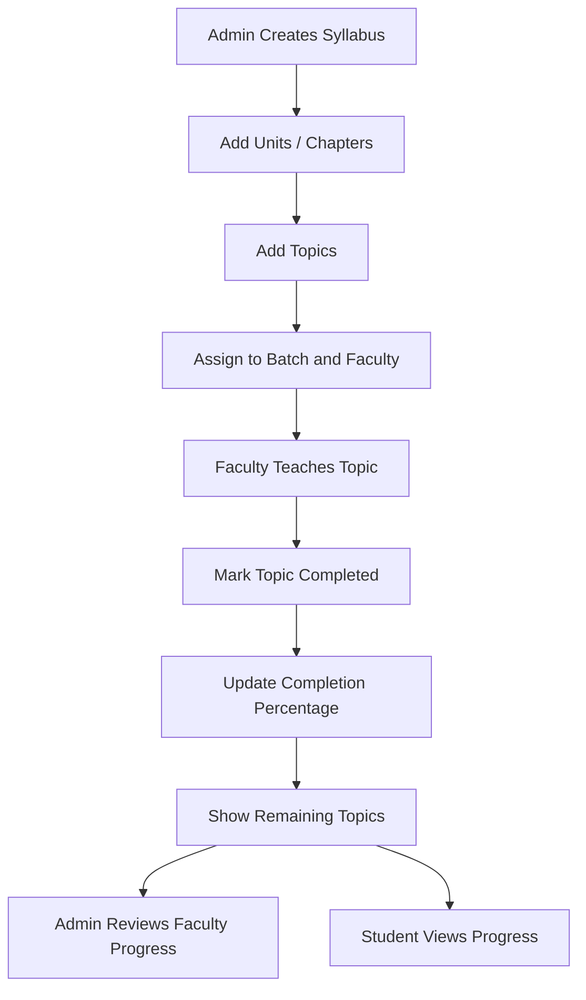

### 12.4 Syllabus Data Structure

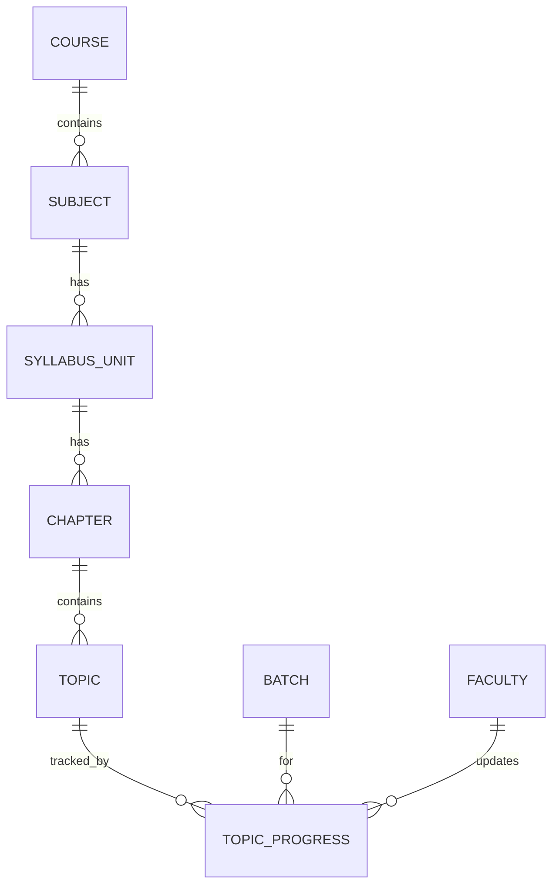

---

## 13. Module 6: Test and Examination Module

### 13.1 Purpose

This module manages complete test and examination lifecycle including basic tests, topic-wise tests, unit tests, subject tests, mock tests, MCQ tests, subjective tests, auto evaluation, OMR upload, rank generation, topper list, and weak topic identification.

### 13.2 Test Phases

| Level | Test Types | Description |
|---|---|---|
| Primary Level | Basic Tests, Topic-wise Tests | Tests focused on basic understanding and individual topics. |
| Intermediate Level | Unit Tests, Subject Tests | Tests for larger subject areas, units, and chapters. |
| Advanced Level | Full Syllabus Mock Tests, Competitive Exam Pattern | Full-length exams based on final or competitive exam format. |

### 13.3 Functional Requirements

| ID | Requirement | Priority |
|---|---|---|
| EX-01 | Admin/Faculty can create tests. | High |
| EX-02 | System supports MCQ tests. | High |
| EX-03 | System supports subjective tests. | High |
| EX-04 | System supports auto evaluation for MCQ tests. | High |
| EX-05 | Faculty can manually evaluate subjective answers. | High |
| EX-06 | System supports OMR sheet upload. | Medium |
| EX-07 | System generates test result and marksheet. | High |
| EX-08 | System generates rank. | High |
| EX-09 | System generates topper list. | High |
| EX-10 | System identifies weak topics based on test performance. | High |
| EX-11 | Students can attempt online tests. | High |
| EX-12 | Faculty/Admin can enter marks manually. | High |
| EX-13 | Marks entry should work offline. | High |
| EX-14 | System supports competitive exam patterns. | High |

### 13.4 Examination Workflow

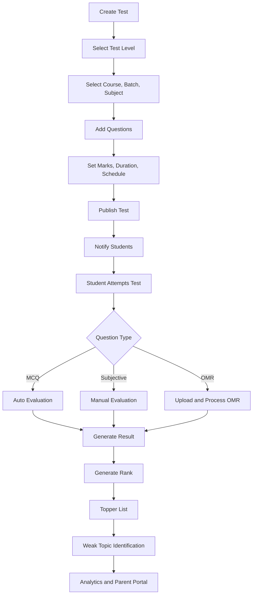

### 13.5 Test Creation Details

| Section | Fields |
|---|---|
| Basic Details | Test name, test code, level, type, course, batch, subject |
| Schedule | Start date/time, end date/time, duration, result publish date |
| Pattern | Total marks, negative marking, question count, sections |
| Question Mapping | Question, topic, difficulty, marks, correct answer, explanation |
| Settings | Shuffle questions, show result immediately, allow reattempt, proctoring optional |

### 13.6 MCQ Test Rules

1. Each MCQ must have one or multiple correct answers.
2. Auto evaluation should calculate marks based on correct, incorrect, skipped, and negative marking rules.
3. Each question should be mapped to subject, chapter, and topic for weak-topic analysis.
4. Test should support timer and auto-submit.

### 13.7 Subjective Test Rules

1. Students can type answers or upload answer PDFs/images.
2. Faculty can evaluate manually and add remarks.
3. Rubrics can be configured for structured evaluation.
4. Marks can be saved online or offline and synced later.

### 13.8 OMR Upload Rules

1. Admin/Faculty can upload scanned OMR sheets.
2. OMR data can be processed by OMR engine or third-party service.
3. System should allow manual correction after OMR processing.
4. OMR records should map to student, test, question, and answer key.

---

## 14. Module 7: Analytics and Performance

### 14.1 Purpose

The Analytics and Performance module provides academic insights including yearly academic record, subject-wise performance, monthly progress graph, improvement analysis, strengths and weaknesses, AI predicted result, student ranking, and batch comparison.

### 14.2 Functional Requirements

| ID | Requirement | Priority |
|---|---|---|
| AN-01 | System shows yearly academic record. | High |
| AN-02 | System shows subject-wise performance. | High |
| AN-03 | System shows monthly progress graph. | High |
| AN-04 | System provides improvement analysis. | High |
| AN-05 | System generates strength and weakness report. | High |
| AN-06 | System predicts final result using AI. | Medium/High |
| AN-07 | System generates student ranking. | High |
| AN-08 | System provides batch comparison. | High |
| AN-09 | Faculty can view batch performance. | High |
| AN-10 | Parent and student can view simplified analytics. | High |

### 14.3 Analytics Workflow

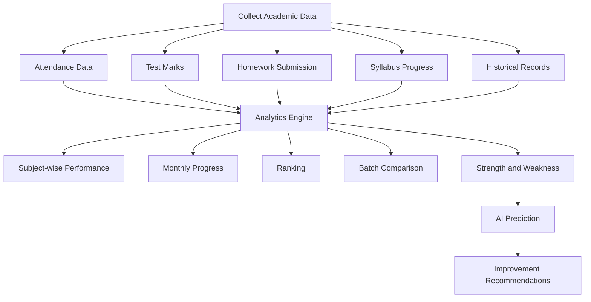

### 14.4 Key Metrics

| Metric | Description |
|---|---|
| Attendance Percentage | Present classes / total classes * 100 |
| Test Average | Average marks across selected tests |
| Subject Score | Weighted score by subject |
| Homework Completion | Submitted assignments / assigned assignments * 100 |
| Syllabus Completion | Completed topics / total topics * 100 |
| Improvement Rate | Current period performance vs previous period |
| Weak Topic Score | Topic-level accuracy below threshold |
| Predicted Final Result | AI/ML prediction based on academic trend |

---

## 15. Module 8: Parent Portal

### 15.1 Purpose

The Parent Portal gives parents access to their child’s academic, attendance, homework, fees, report cards, calendar, and notification information.

### 15.2 Functional Requirements

| ID | Requirement | Priority |
|---|---|---|
| PP-01 | Parent can login securely. | High |
| PP-02 | Parent can view child attendance. | High |
| PP-03 | Parent can view marks. | High |
| PP-04 | Parent can view homework. | High |
| PP-05 | Parent can view fees status. | High |
| PP-06 | Parent can download report cards. | High |
| PP-07 | Parent can receive notifications through SMS, WhatsApp, and Email. | High |
| PP-08 | Parent can view exam schedule and holidays. | High |
| PP-09 | Parent can view parent meeting schedule. | Medium |
| PP-10 | Parent can manage notification preferences. | Medium |

### 15.3 Parent Portal Workflow

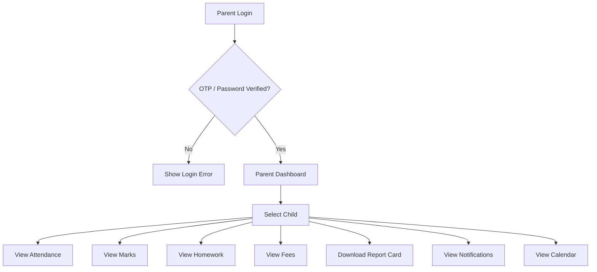

---

## 16. Module 9: Fees Management

### 16.1 Purpose

The Fees Management module manages fee collection, online payments, pending fees, due date reminders, automatic receipt generation, and optional GST invoices.

### 16.2 Functional Requirements

| ID | Requirement | Priority |
|---|---|---|
| FM-01 | Admin can create fee structure. | High |
| FM-02 | Admin can assign fees to students/courses/batches. | High |
| FM-03 | Admin/Accountant can collect fees. | High |
| FM-04 | System supports online payment. | High |
| FM-05 | System shows pending fees list. | High |
| FM-06 | System sends due date reminders. | High |
| FM-07 | System generates automatic receipts. | High |
| FM-08 | System supports partial payments. | High |
| FM-09 | System supports discounts/scholarships. | Medium |
| FM-10 | System supports optional GST invoice. | Medium |
| FM-11 | Parent can view fees status and receipts. | High |

### 16.3 Fees Workflow

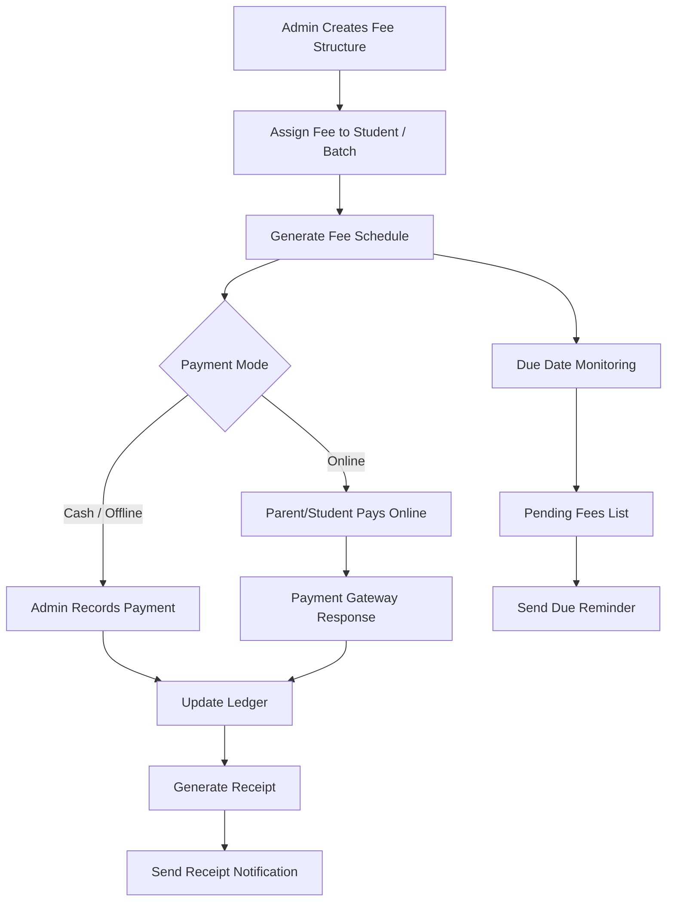

### 16.4 Fee Data Fields

| Entity | Fields |
|---|---|
| Fee Structure | Name, course, batch, academic year, amount, installments, due dates |
| Fee Assignment | Student, fee structure, discount, payable amount |
| Payment | Student, amount, mode, transaction ID, status, paid date |
| Receipt | Receipt number, payment details, generated date, generated by |
| Invoice | GST number, tax rate, invoice number, taxable amount, tax amount |

---

## 17. Module 10: Homework and Assignment Module

### 17.1 Purpose

This module allows faculty to upload homework, assignments, PDF notes, video notes, track deadlines, receive student submissions, check submissions, and give feedback.

### 17.2 Functional Requirements

| ID | Requirement | Priority |
|---|---|---|
| HW-01 | Faculty can create homework. | High |
| HW-02 | Faculty can upload PDF notes. | High |
| HW-03 | Faculty can upload/link video notes. | High |
| HW-04 | Faculty can set submission deadline. | High |
| HW-05 | Student can submit assignment. | High |
| HW-06 | Faculty can check submissions. | High |
| HW-07 | Faculty can add marks/remarks. | Medium |
| HW-08 | System tracks pending and late submissions. | High |
| HW-09 | Parent can view homework status. | High |
| HW-10 | System sends deadline reminders. | High |
| HW-11 | Notes should be accessible offline if downloaded/synced. | High |

### 17.3 Homework Workflow

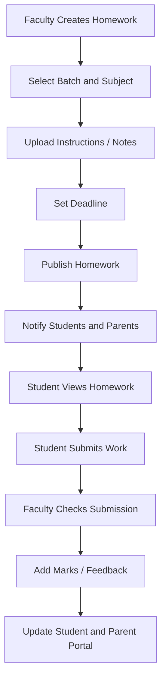

---

## 18. Module 11: Notification System

### 18.1 Purpose

The Notification System sends automatic and manual notifications through SMS, WhatsApp, Email, and in-app alerts for attendance, marks, homework, fee due, exam schedule, holiday notices, and parent meetings.

### 18.2 Notification Types

| Notification Type | Trigger | Recipient |
|---|---|---|
| Attendance | Student marked absent | Parent, Student optional |
| Marks | Result published | Student, Parent |
| Homework | Homework assigned/deadline near | Student, Parent |
| Fee Due | Due date approaching or overdue | Parent, Student optional |
| Exam Schedule | Exam/test created or updated | Student, Parent, Faculty |
| Holiday Notice | Holiday added | Student, Parent, Faculty |
| Parent Meeting | Meeting scheduled/reminder | Parent, Faculty, Admin |
| Live Class | Class scheduled/reminder | Student, Parent optional |

### 18.3 Notification Workflow

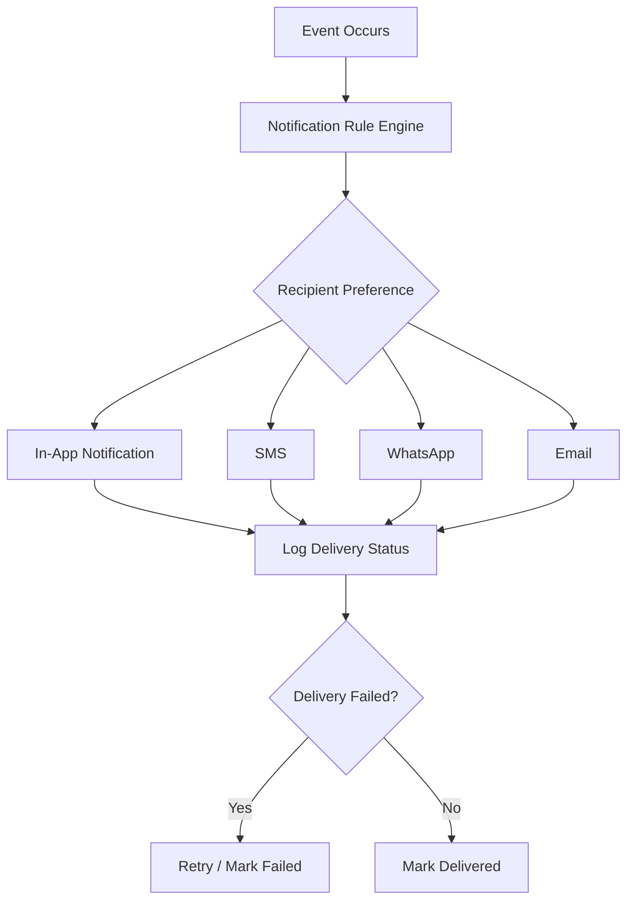

### 18.4 Notification Template Example

| Template | Example Message |
|---|---|
| Attendance Absence | Dear Parent, your child {{student_name}} is absent today for {{batch_name}}. |
| Fee Due | Dear Parent, fee amount ₹{{amount}} for {{student_name}} is due on {{due_date}}. |
| Marks Published | Marks for {{test_name}} have been published. Please check the portal. |
| Homework | New homework has been assigned in {{subject_name}}. Deadline: {{deadline}}. |

---

## 19. Module 12: Calendar Module

### 19.1 Purpose

The Calendar Module manages academic calendar, exam calendar, holidays, events, and parent meeting schedules.

### 19.2 Functional Requirements

| ID | Requirement | Priority |
|---|---|---|
| CL-01 | Admin can create academic calendar. | High |
| CL-02 | Admin/Faculty can create exam calendar. | High |
| CL-03 | Admin can add holidays. | High |
| CL-04 | Admin can add events. | Medium |
| CL-05 | Admin can schedule parent meetings. | High |
| CL-06 | Users can view calendar based on role. | High |
| CL-07 | System sends reminders for calendar events. | High |

### 19.3 Calendar Workflow

```mermaid
flowchart TD
    A[Admin Opens Calendar] --> B[Create Event]
    B --> C{Event Type}
    C -- Academic --> D[Academic Calendar]
    C -- Exam --> E[Exam Calendar]
    C -- Holiday --> F[Holiday]
    C -- Parent Meeting --> G[Meeting Schedule]
    C -- Other Event --> H[Event]
    D --> I[Select Audience]
    E --> I
    F --> I
    G --> I
    H --> I
    I --> J[Save Event]
    J --> K[Notify Users]
```

---

## 20. Module 13: Offline Mode and PWA Support

### 20.1 Purpose

Offline support is a critical requirement. The LMS should allow key operations to continue even without internet, especially attendance, marks entry, notes access, and syllabus access.

### 20.2 Offline Functional Requirements

| ID | Requirement | Priority |
|---|---|---|
| OF-01 | PWA should be installable on desktop/mobile browser. | High |
| OF-02 | Attendance should work offline. | High |
| OF-03 | Marks entry should work offline. | High |
| OF-04 | Data should sync automatically when internet returns. | High |
| OF-05 | Notes should be accessible offline if preloaded/downloaded. | High |
| OF-06 | Syllabus should be accessible offline. | High |
| OF-07 | Offline records should show pending sync status. | High |
| OF-08 | Conflict resolution should be implemented. | High |
| OF-09 | System should keep audit logs for offline changes. | High |

### 20.3 Offline Data Storage

| Data Type | Offline Storage | Sync Direction |
|---|---|---|
| Attendance | IndexedDB / SQLite | Client to Server |
| Marks Entry | IndexedDB / SQLite | Client to Server |
| Syllabus | IndexedDB / SQLite Cache | Server to Client |
| Notes PDF | Cache Storage / Local File | Server to Client |
| Homework List | IndexedDB Cache | Server to Client |
| Student List for Assigned Batch | IndexedDB Cache | Server to Client |

### 20.4 Offline Sync Workflow

```mermaid
sequenceDiagram
    participant User
    participant PWA
    participant LocalDB as IndexedDB/SQLite
    participant SyncEngine
    participant API
    participant ServerDB

    User->>PWA: Perform offline action
    PWA->>LocalDB: Save record with pending_sync status
    PWA-->>User: Show saved offline message
    SyncEngine->>PWA: Monitor internet status
    alt Internet unavailable
        SyncEngine-->>PWA: Keep records pending
    else Internet available
        SyncEngine->>LocalDB: Read pending records
        SyncEngine->>API: Push records with local timestamp/version
        API->>ServerDB: Validate and save
        ServerDB-->>API: Save response
        API-->>SyncEngine: Success or conflict
        alt Success
            SyncEngine->>LocalDB: Mark as synced
        else Conflict
            SyncEngine->>LocalDB: Mark as conflict
            SyncEngine-->>User: Ask for resolution or apply rule
        end
    end
```

### 20.5 Sync Conflict Resolution Rules

| Scenario | Suggested Resolution |
|---|---|
| Same attendance marked twice | Latest valid update wins, Admin audit log maintained. |
| Faculty offline mark conflicts with Admin online edit | Admin edit wins by default; conflict shown to Faculty/Admin. |
| Duplicate marks entry | Use latest version or Admin-approved version. |
| Student list changed while offline | Sync allowed only for students valid in batch on attendance date. |
| Deleted/archived student marked offline | Record rejected or sent for Admin review. |

### 20.6 PWA Requirements

1. Service worker for offline caching.
2. App manifest for installability.
3. IndexedDB for structured local data.
4. Background sync where supported.
5. Manual sync button as fallback.
6. Offline indicator in UI.
7. Pending sync count visible to Faculty/Admin.

---

## 21. Module 14: AI Features

### 21.1 Purpose

AI features help students, parents, faculty, and admins understand performance trends, detect weak subjects/topics, suggest improvement plans, recommend practice tests, predict exam performance, and answer common queries through an AI chatbot.

### 21.2 AI Student Analysis

| Feature | Description |
|---|---|
| Weak Subject Detection | Detects subjects with low marks, low accuracy, or declining trend. |
| Weak Topic Detection | Uses question-topic mapping to identify low-performing topics. |
| Improvement Plans | Suggests topic revision, practice tests, and study schedule. |
| Exam Performance Prediction | Predicts final score based on attendance, tests, homework, and historical performance. |
| Risk Alerts | Alerts faculty/admin if student performance is consistently declining. |

### 21.3 AI Chatbot

The AI chatbot can answer:

1. Student queries
2. Syllabus queries
3. Exam schedule queries
4. Homework queries
5. Class schedule queries
6. Basic fee status queries, if permitted
7. Study recommendations

### 21.4 Smart Recommendations

1. Suggest practice tests.
2. Suggest revision topics.
3. Suggest recorded lectures.
4. Suggest notes to download.
5. Suggest faculty intervention for high-risk students.

### 21.5 AI Workflow

```mermaid
flowchart TD
    A[Collect Student Data] --> B[Attendance]
    A --> C[Test Results]
    A --> D[Homework Submissions]
    A --> E[Syllabus Progress]
    A --> F[Historical Performance]
    B --> G[AI Analysis Engine]
    C --> G
    D --> G
    E --> G
    F --> G
    G --> H[Weak Subject Detection]
    G --> I[Weak Topic Detection]
    G --> J[Performance Prediction]
    G --> K[Improvement Plan]
    K --> L[Recommend Practice Tests]
    K --> M[Recommend Revision Topics]
    K --> N[Notify Student/Parent/Faculty]
```

### 21.6 AI Chatbot Workflow

```mermaid
sequenceDiagram
    participant User as Student/Parent/Faculty
    participant Chatbot
    participant Auth
    participant LMSData as LMS Data Layer
    participant AI as AI Engine

    User->>Chatbot: Ask question
    Chatbot->>Auth: Check user role and permissions
    Auth-->>Chatbot: Allowed data scope
    Chatbot->>LMSData: Retrieve relevant LMS data
    LMSData-->>Chatbot: Return syllabus/schedule/performance data
    Chatbot->>AI: Generate response using allowed data
    AI-->>Chatbot: Response
    Chatbot-->>User: Show answer
```

### 21.7 AI Governance Rules

1. AI predictions should be shown as advisory, not final decisions.
2. Sensitive student data must be protected by role-based permissions.
3. Parent should only view data of linked child/children.
4. AI recommendations should include explainable reasons where possible.
5. AI logs should not expose confidential personal information unnecessarily.

---

## 22. Module 15: Faculty Module

### 22.1 Purpose

The Faculty Module enables teachers to manage daily academic operations for their assigned batches.

### 22.2 Faculty Capabilities

Faculty can:

1. View assigned batches and students.
2. Take attendance.
3. Use QR attendance.
4. Work offline for attendance and marks entry.
5. Upload notes and video notes.
6. Create homework.
7. Check assignment submissions.
8. Create tests.
9. Enter marks.
10. Evaluate subjective tests.
11. Track syllabus completion.
12. View batch performance.
13. Send notifications to assigned batches, based on permission.

### 22.3 Faculty Dashboard Widgets

| Widget | Description |
|---|---|
| Today’s Classes | List of assigned classes for the day. |
| Attendance Pending | Batches where attendance is not marked. |
| Homework Pending Review | Submissions waiting for checking. |
| Upcoming Tests | Scheduled tests for assigned batches. |
| Syllabus Progress | Subject-wise completion percentage. |
| Weak Students | Students needing academic attention. |
| Offline Sync Status | Pending attendance/marks records to sync. |

---

## 23. Module 16: Admin Dashboard

### 23.1 Purpose

The Admin Dashboard provides a centralized view and control over the entire LMS.

### 23.2 Admin Capabilities

Admin can:

1. Manage students.
2. Manage faculty.
3. Manage parents.
4. Manage fees.
5. Manage tests.
6. Manage batches.
7. Generate reports.
8. View analytics.
9. Manage notifications.
10. Configure roles and permissions.
11. Manage calendar.
12. Manage backup and restore.
13. View activity logs.

### 23.3 Admin Dashboard Widgets

| Widget | Description |
|---|---|
| Total Students | Active, inactive, new admissions. |
| Fees Summary | Collected, pending, overdue. |
| Attendance Summary | Daily attendance percentage and absent list. |
| Test Summary | Recently conducted tests and average score. |
| Batch Performance | Comparison of batches. |
| Faculty Activity | Attendance taken, notes uploaded, marks entered. |
| Notifications | Sent, delivered, failed. |
| Offline Sync Monitor | Pending sync records by faculty/device. |

---

## 24. Module 17: Reports

### 24.1 Purpose

The Reports module generates printable and downloadable reports for academics, attendance, fees, faculty, batches, and yearly performance.

### 24.2 Report List

| Report | Users | Format |
|---|---|---|
| Student Report Card | Admin, Student, Parent | PDF, Excel |
| Attendance Report | Admin, Faculty, Parent, Student | PDF, Excel |
| Fee Report | Admin, Accountant, Parent | PDF, Excel |
| Faculty Report | Admin | PDF, Excel |
| Batch Report | Admin, Faculty | PDF, Excel |
| Yearly Performance Report | Admin, Faculty, Parent, Student | PDF |
| Test Result Report | Admin, Faculty, Parent, Student | PDF, Excel |
| Syllabus Completion Report | Admin, Faculty | PDF, Excel |
| Homework Submission Report | Admin, Faculty | PDF, Excel |
| Pending Fees Report | Admin, Accountant | PDF, Excel |

### 24.3 Report Generation Workflow

```mermaid
flowchart TD
    A[User Opens Reports] --> B[Select Report Type]
    B --> C[Apply Filters]
    C --> D[Generate Preview]
    D --> E{Export Needed?}
    E -- No --> F[View Report]
    E -- Yes --> G{Export Format}
    G -- PDF --> H[Generate PDF]
    G -- Excel --> I[Generate Excel]
    H --> J[Download / Share]
    I --> J
```

### 24.4 Common Report Filters

1. Academic year
2. Course
3. Batch
4. Subject
5. Student
6. Faculty
7. Date range
8. Test type
9. Payment status
10. Attendance status

---

## 25. Module 18: Security Features

### 25.1 Purpose

The Security module protects user accounts, student data, academic records, fee transactions, files, and administrative operations.

### 25.2 Functional Requirements

| ID | Requirement | Priority |
|---|---|---|
| SC-01 | Role-based access control for Admin, Faculty, Student, Parent. | High |
| SC-02 | OTP login should be supported. | High |
| SC-03 | Secure authentication with password hashing/token-based access. | High |
| SC-04 | Parent can access only linked child records. | High |
| SC-05 | Faculty can access only assigned batches/subjects unless permitted. | High |
| SC-06 | Admin can manage roles and permissions. | High |
| SC-07 | System maintains activity logs. | High |
| SC-08 | System supports backup and restore. | High |
| SC-09 | Sensitive data must be encrypted in transit. | High |
| SC-10 | Important actions require audit logging. | High |

### 25.3 Role-Based Access Matrix

| Module / Feature | Admin | Faculty | Student | Parent |
|---|---:|---:|---:|---:|
| Student Registration | Full | No | No | No |
| Student Profile | Full | Assigned View | Own View | Child View |
| Attendance Entry | Full | Assigned Batches | No | No |
| Attendance View | Full | Assigned Batches | Own | Child |
| Course/Batch Management | Full | Assigned View | View Own | Child View |
| Live Class Create | Full | Assigned Batches | No | No |
| Live Class Join | No | Host | Join Own | View Schedule |
| Syllabus Manage | Full | Assigned Subjects | View | View Child |
| Test Create | Full | Assigned Subjects | No | No |
| Test Attempt | No | No | Yes | No |
| Marks Entry | Full | Assigned Tests | No | No |
| Marks View | Full | Assigned Batches | Own | Child |
| Homework Create | Full | Assigned Batches | No | No |
| Homework Submit | No | No | Yes | No |
| Fees Management | Full | No/View Optional | View Own | Child View/Pay |
| Reports | Full | Assigned Scope | Own | Child |
| Notifications | Full | Assigned Scope | Receive | Receive |
| Calendar Manage | Full | Limited | View | View |
| AI Analytics | Full | Assigned Scope | Own | Child |
| Backup/Restore | Full | No | No | No |
| Activity Logs | Full | Own Activity Optional | No | No |

### 25.4 Authentication Flow

```mermaid
sequenceDiagram
    participant User
    participant App
    participant AuthAPI
    participant OTPService
    participant DB

    User->>App: Enter mobile/email
    App->>AuthAPI: Request OTP
    AuthAPI->>DB: Validate user exists
    AuthAPI->>OTPService: Send OTP
    OTPService-->>User: OTP via SMS/Email
    User->>App: Enter OTP
    App->>AuthAPI: Verify OTP
    AuthAPI->>DB: Check OTP and role
    alt Valid OTP
        AuthAPI-->>App: Access token + role permissions
        App-->>User: Open role dashboard
    else Invalid OTP
        AuthAPI-->>App: Error
        App-->>User: Show invalid OTP message
    end
```

### 25.5 Activity Logging

The system should log:

1. Login and logout events.
2. Student creation/update/deactivation.
3. Attendance creation/update.
4. Marks entry/update.
5. Fee payment and receipt generation.
6. Report downloads.
7. Role/permission changes.
8. Data export.
9. Backup and restore activities.
10. Offline sync changes.

---

## 26. Major Database Entities

```mermaid
erDiagram
    USER ||--o{ USER_ROLE : has
    ROLE ||--o{ USER_ROLE : assigned
    USER ||--o| STUDENT : may_be
    USER ||--o| FACULTY : may_be
    USER ||--o| PARENT : may_be
    PARENT ||--o{ STUDENT_PARENT : linked
    STUDENT ||--o{ STUDENT_PARENT : has

    COURSE ||--o{ SUBJECT : contains
    COURSE ||--o{ BATCH : has
    SUBJECT ||--o{ BATCH_SUBJECT : assigned
    BATCH ||--o{ BATCH_SUBJECT : contains
    FACULTY ||--o{ FACULTY_ASSIGNMENT : assigned
    BATCH ||--o{ FACULTY_ASSIGNMENT : has
    SUBJECT ||--o{ FACULTY_ASSIGNMENT : for
    BATCH ||--o{ STUDENT_BATCH : includes
    STUDENT ||--o{ STUDENT_BATCH : enrolled

    STUDENT ||--o{ ATTENDANCE : has
    BATCH ||--o{ ATTENDANCE : records
    SUBJECT ||--o{ ATTENDANCE : for
    FACULTY ||--o{ ATTENDANCE : marked_by

    SUBJECT ||--o{ SYLLABUS_UNIT : has
    SYLLABUS_UNIT ||--o{ CHAPTER : has
    CHAPTER ||--o{ TOPIC : contains
    TOPIC ||--o{ TOPIC_PROGRESS : progress
    BATCH ||--o{ TOPIC_PROGRESS : for

    TEST ||--o{ QUESTION : contains
    QUESTION ||--o{ OPTION : has
    STUDENT ||--o{ TEST_ATTEMPT : attempts
    TEST ||--o{ TEST_ATTEMPT : has
    TEST_ATTEMPT ||--o{ ANSWER : includes
    TEST_ATTEMPT ||--o| RESULT : generates

    STUDENT ||--o{ HOMEWORK_SUBMISSION : submits
    HOMEWORK ||--o{ HOMEWORK_SUBMISSION : receives
    FACULTY ||--o{ HOMEWORK : creates

    STUDENT ||--o{ FEE_ASSIGNMENT : has
    FEE_STRUCTURE ||--o{ FEE_ASSIGNMENT : assigned
    FEE_ASSIGNMENT ||--o{ PAYMENT : paid_by
    PAYMENT ||--o| RECEIPT : generates

    USER ||--o{ NOTIFICATION : receives
    CALENDAR_EVENT ||--o{ NOTIFICATION : triggers
```

---

## 27. Suggested Database Tables

### 27.1 User and Security Tables

1. users
2. roles
3. permissions
4. user_roles
5. role_permissions
6. otp_logs
7. login_sessions
8. activity_logs

### 27.2 Student Tables

1. students
2. student_profiles
3. student_addresses
4. student_documents
5. parents
6. student_parent_links
7. emergency_contacts
8. admissions

### 27.3 Academic Tables

1. courses
2. subjects
3. batches
4. batch_subjects
5. classrooms
6. faculty
7. faculty_assignments
8. student_batches
9. class_schedules
10. live_classes
11. lecture_recordings

### 27.4 Attendance Tables

1. attendance_sessions
2. attendance_records
3. qr_attendance_tokens
4. biometric_attendance_logs future
5. offline_sync_records

### 27.5 Syllabus Tables

1. syllabus_units
2. chapters
3. topics
4. topic_progress
5. syllabus_files

### 27.6 Examination Tables

1. tests
2. test_sections
3. questions
4. question_options
5. question_topic_mapping
6. test_attempts
7. student_answers
8. results
9. ranks
10. omr_uploads
11. evaluation_logs

### 27.7 Homework Tables

1. homework
2. homework_files
3. homework_submissions
4. submission_feedback

### 27.8 Fees Tables

1. fee_structures
2. fee_installments
3. fee_assignments
4. payments
5. receipts
6. invoices
7. discounts
8. refunds optional

### 27.9 Notification and Calendar Tables

1. notification_templates
2. notifications
3. notification_delivery_logs
4. user_notification_preferences
5. calendar_events
6. parent_meetings

### 27.10 AI and Analytics Tables

1. analytics_snapshots
2. student_performance_metrics
3. weak_topic_analysis
4. ai_predictions
5. ai_recommendations
6. chatbot_logs

---

## 28. API Design Overview

### 28.1 Authentication APIs

| Method | Endpoint | Description |
|---|---|---|
| POST | /api/auth/request-otp | Send OTP to user. |
| POST | /api/auth/verify-otp | Verify OTP and login. |
| POST | /api/auth/login | Password-based login optional. |
| POST | /api/auth/logout | Logout user. |
| GET | /api/auth/me | Get logged-in user profile and permissions. |

### 28.2 Student APIs

| Method | Endpoint | Description |
|---|---|---|
| POST | /api/students | Create student. |
| GET | /api/students | List students. |
| GET | /api/students/{id} | Get student profile. |
| PUT | /api/students/{id} | Update student. |
| POST | /api/students/{id}/documents | Upload documents. |
| POST | /api/students/{id}/assign-batch | Assign batch. |

### 28.3 Attendance APIs

| Method | Endpoint | Description |
|---|---|---|
| POST | /api/attendance/sessions | Create attendance session. |
| POST | /api/attendance/mark | Mark attendance. |
| POST | /api/attendance/bulk | Bulk attendance upload/sync. |
| GET | /api/attendance/absent-list | Get absent list. |
| GET | /api/attendance/report/monthly | Monthly attendance report. |
| POST | /api/attendance/qr/generate | Generate QR code. |
| POST | /api/attendance/qr/scan | Submit QR scan. |

### 28.4 Course and Batch APIs

| Method | Endpoint | Description |
|---|---|---|
| POST | /api/courses | Create course. |
| GET | /api/courses | List courses. |
| POST | /api/subjects | Create subject. |
| POST | /api/batches | Create batch. |
| POST | /api/batches/{id}/assign-faculty | Assign faculty. |
| POST | /api/batches/{id}/students | Add students to batch. |

### 28.5 Exam APIs

| Method | Endpoint | Description |
|---|---|---|
| POST | /api/tests | Create test. |
| GET | /api/tests | List tests. |
| POST | /api/tests/{id}/questions | Add questions. |
| POST | /api/tests/{id}/publish | Publish test. |
| POST | /api/tests/{id}/attempts | Start/submit attempt. |
| POST | /api/tests/{id}/marks | Enter marks. |
| GET | /api/tests/{id}/results | Get results. |
| GET | /api/tests/{id}/ranks | Get ranks. |

### 28.6 Fees APIs

| Method | Endpoint | Description |
|---|---|---|
| POST | /api/fees/structures | Create fee structure. |
| POST | /api/fees/assign | Assign fee to student. |
| POST | /api/payments | Record payment. |
| POST | /api/payments/online/initiate | Initiate online payment. |
| POST | /api/payments/online/webhook | Payment gateway webhook. |
| GET | /api/fees/pending | Pending fees list. |
| GET | /api/receipts/{id} | Download receipt. |

### 28.7 Offline Sync APIs

| Method | Endpoint | Description |
|---|---|---|
| GET | /api/sync/bootstrap | Download offline master data. |
| POST | /api/sync/push | Push offline records to server. |
| GET | /api/sync/pull | Pull latest changes from server. |
| GET | /api/sync/status | Get sync status. |
| POST | /api/sync/resolve-conflict | Resolve sync conflict. |

---

## 29. Permission and Access Logic

### 29.1 Admin

Admin has full access to institute-level data. Admin can create, update, delete, export, and report on all records based on assigned permissions.

### 29.2 Faculty

Faculty access should be limited to:

1. Assigned batches.
2. Assigned subjects.
3. Assigned students within those batches.
4. Tests, homework, notes, and marks created by them or assigned to them.
5. Batch performance for assigned batches only.

### 29.3 Student

Student access should be limited to:

1. Own profile.
2. Own attendance.
3. Own marks and report cards.
4. Own homework and assignments.
5. Own fees view, if allowed.
6. Own classes, notes, and syllabus.
7. AI recommendations related to self only.

### 29.4 Parent

Parent access should be limited to:

1. Linked child/children only.
2. Attendance, marks, homework, fees, reports, calendar, and notifications of linked child/children.
3. Download receipts/report cards for linked child/children only.

---

## 30. Notifications by Module

| Module | Notification Trigger | Recipient |
|---|---|---|
| Student Management | Admission completed | Student, Parent |
| Attendance | Student absent | Parent |
| Attendance | Monthly attendance low | Parent, Student, Faculty |
| Live Classes | Class scheduled | Student, Parent optional |
| Tests | Test scheduled | Student, Parent |
| Tests | Result published | Student, Parent |
| Syllabus | Low syllabus progress | Admin, Faculty |
| Homework | New homework assigned | Student, Parent |
| Homework | Deadline reminder | Student, Parent |
| Fees | Fee due soon | Parent, Student optional |
| Fees | Payment received | Parent, Student optional |
| Calendar | Holiday/event/meeting | Relevant users |
| AI | Weak performance alert | Student, Parent, Faculty |

---

## 31. Report Card Design Requirements

A student report card should include:

1. Institute name, logo, address.
2. Student name, admission number, course, batch.
3. Academic year.
4. Subject-wise marks.
5. Total marks and percentage.
6. Grade.
7. Rank.
8. Attendance percentage.
9. Faculty remarks.
10. Strength and weakness summary.
11. Improvement suggestions.
12. Signature placeholders.
13. Download/print option.

### 31.1 Report Card Workflow

```mermaid
flowchart TD
    A[Admin/Faculty Selects Student] --> B[Select Academic Year / Test / Term]
    B --> C[Fetch Marks]
    C --> D[Fetch Attendance]
    D --> E[Calculate Percentage and Grade]
    E --> F[Generate Rank]
    F --> G[Add Remarks and AI Summary Optional]
    G --> H[Generate PDF Report Card]
    H --> I[Publish to Parent and Student Portal]
```

---

## 32. Dashboards

### 32.1 Admin Dashboard

Key cards:

1. Total students
2. New admissions
3. Total faculty
4. Total batches
5. Today’s attendance
6. Absent students
7. Pending fees
8. Upcoming exams
9. Recent payments
10. Notification delivery status
11. Batch comparison chart
12. Offline sync pending records

### 32.2 Faculty Dashboard

Key cards:

1. Today’s classes
2. Assigned batches
3. Attendance pending
4. Homework submissions pending
5. Upcoming tests
6. Syllabus completion percentage
7. Weak students
8. Offline sync status

### 32.3 Student Dashboard

Key cards:

1. Attendance percentage
2. Upcoming live classes
3. Homework due
4. Upcoming tests
5. Latest marks
6. Syllabus progress
7. AI recommendations
8. Notifications

### 32.4 Parent Dashboard

Key cards:

1. Child attendance
2. Latest marks
3. Homework status
4. Pending fees
5. Report cards
6. Upcoming exams
7. Notifications
8. Parent meeting schedule

---

## 33. User Interface Requirements

### 33.1 General UI Requirements

1. Responsive design for desktop, tablet, and mobile.
2. Role-based dashboards.
3. Simple navigation menu.
4. Search, filters, and pagination for large lists.
5. Export buttons for reports.
6. Offline/online status indicator.
7. Notification bell.
8. Multi-language support optional.
9. Light/dark theme optional.
10. Accessibility-friendly UI.

### 33.2 Important Screens

| Module | Screens |
|---|---|
| Student | Student list, registration form, admission form, profile, documents |
| Attendance | Batch attendance, QR attendance, absent list, monthly report |
| Batch | Course list, subject list, batch creation, faculty assignment |
| Live Class | Schedule class, class list, recordings |
| Syllabus | Syllabus builder, topic progress, faculty progress |
| Exam | Test creation, question bank, test attempt, evaluation, result, ranks |
| Fees | Fee structure, collection, pending fees, receipt, invoice |
| Homework | Homework list, upload homework, submissions, feedback |
| Notifications | Template management, send notification, delivery logs |
| Calendar | Month/week/list calendar, event form |
| Reports | Report list, filters, preview, export |
| Admin | Dashboard, users, roles, settings, logs |

---

## 34. Non-Functional Requirements

### 34.1 Performance

1. Dashboard should load within 3 seconds under normal conditions.
2. Attendance student list should load quickly for batches up to at least 500 students.
3. Reports should support background generation for large data.
4. Offline cache should load critical pages without network.

### 34.2 Scalability

1. System should support multiple courses, batches, and academic years.
2. Architecture should allow future multi-branch support.
3. Notification sending should be queue-based for bulk delivery.
4. File storage should be scalable using local storage, S3-compatible storage, or cloud storage.

### 34.3 Availability

1. Critical APIs should have monitoring.
2. Regular backups should be scheduled.
3. Offline mode should reduce dependency on continuous internet.

### 34.4 Security

1. HTTPS must be used in production.
2. Passwords must be hashed securely.
3. Tokens should expire and refresh securely.
4. File access should be permission-controlled.
5. Audit logs should be immutable or protected from normal users.

### 34.5 Compliance and Privacy

1. Student personal data must be protected.
2. Data export should be permission-controlled.
3. Parents must only access their own child data.
4. AI processing should follow privacy and consent rules.

---

## 35. Suggested Tech Stack

### 35.1 Web

| Layer | Suggested Technology |
|---|---|
| Frontend | Next.js / React |
| UI | Tailwind CSS / Material UI / Ant Design |
| State Management | Redux Toolkit / Zustand / React Query |
| Charts | Recharts / Chart.js / ECharts |
| PWA | Service Worker, Web App Manifest |
| Offline DB | IndexedDB using Dexie.js |

### 35.2 Backend

| Layer | Option 1 | Option 2 |
|---|---|---|
| API | Laravel REST API | Node.js / NestJS / Express |
| Database | MySQL | PostgreSQL |
| Cache/Queue | Redis | Redis |
| File Storage | Local/S3-compatible | Cloud Storage |
| Auth | JWT / Sanctum / Passport | JWT / OAuth2 |

### 35.3 Mobile App

| Layer | Suggested Technology |
|---|---|
| Mobile | React Native |
| Offline DB | SQLite / WatermelonDB / Realm |
| Push Notification | Firebase Cloud Messaging |

### 35.4 Integrations

| Integration | Purpose |
|---|---|
| SMS Gateway | OTP, attendance, fee reminders |
| WhatsApp API | Parent/student communication |
| Email Service | Reports, notices, receipts |
| Payment Gateway | Online fee collection |
| Meeting Tools | Zoom, Google Meet, Teams links |
| AI API/Model | Student analysis and chatbot |
| OMR Engine | OMR sheet evaluation |
| Biometric Device | Future attendance integration |

---

## 36. Implementation Phases

### Phase 1: Core LMS

1. Authentication and role-based access
2. Admin dashboard
3. Student management
4. Course and batch management
5. Faculty management
6. Attendance management
7. Basic reports

### Phase 2: Academic Operations

1. Syllabus management
2. Homework and assignments
3. Live classes and recordings
4. Test and examination module
5. Marks entry and report cards
6. Parent portal

### Phase 3: Finance and Communication

1. Fees management
2. Online payments
3. Receipts and optional GST invoice
4. SMS/WhatsApp/Email notifications
5. Calendar module

### Phase 4: Offline and Analytics

1. PWA support
2. Offline attendance
3. Offline marks entry
4. Sync engine
5. Analytics dashboards
6. Batch comparison

### Phase 5: AI and Advanced Features

1. Weak subject/topic detection
2. Improvement recommendations
3. Predicted final result
4. AI chatbot
5. OMR upload
6. Biometric integration future

---

## 37. Acceptance Criteria

### 37.1 Student Management

1. Admin can create a student with all required details.
2. Student ID is generated automatically.
3. Documents and photo can be uploaded.
4. Student can be assigned to course and batch.
5. Parent login can view linked student details.

### 37.2 Attendance

1. Faculty can mark attendance for assigned batches.
2. Attendance works offline.
3. Offline attendance syncs when internet returns.
4. Absent list is generated.
5. Parent receives absence notification.
6. Monthly attendance report is generated.

### 37.3 Exams

1. Admin/Faculty can create tests by level and type.
2. Students can attempt MCQ tests.
3. MCQ tests are auto-evaluated.
4. Subjective marks can be manually entered.
5. Rank and topper list are generated.
6. Weak topics are identified.

### 37.4 Parent Portal

1. Parent can view child attendance, marks, homework, fees, and report cards.
2. Parent receives notifications by configured channels.
3. Parent can download report cards and receipts.

### 37.5 Fees

1. Admin can create fee structure.
2. Admin can collect fees.
3. Online payment can be initiated.
4. Receipt is generated automatically.
5. Pending fees list and due reminders work.

### 37.6 Offline Mode

1. Attendance can be saved without internet.
2. Marks can be saved without internet.
3. Pending sync status is visible.
4. Data automatically syncs after internet returns.
5. Conflicts are logged and resolved.

### 37.7 Security

1. User access is restricted by role.
2. OTP login works.
3. Parent cannot access another student’s data.
4. Faculty cannot access unassigned batch data.
5. Activity logs are generated for critical actions.

---

## 38. Risks and Mitigation

| Risk | Impact | Mitigation |
|---|---|---|
| Poor internet connectivity | Attendance/marks may be delayed | Offline PWA, sync engine, local database |
| Duplicate offline records | Incorrect reports | Unique record keys and conflict resolution |
| Notification delivery failure | Parents may miss updates | Delivery logs, retries, fallback channels |
| Large video storage cost | High infrastructure cost | Store external video links or cloud storage |
| AI prediction inaccuracies | Misleading guidance | Mark as advisory, explainable results, human review |
| Payment failure | Fee mismatch | Webhook validation and payment reconciliation |
| Unauthorized access | Data breach | RBAC, audit logs, token expiry, encryption |

---

## 39. Sample Menu Structure

### Admin Menu

1. Dashboard
2. Students
3. Admissions
4. Faculty
5. Parents
6. Courses
7. Batches
8. Attendance
9. Live Classes
10. Syllabus
11. Tests and Exams
12. Homework
13. Fees
14. Calendar
15. Notifications
16. Analytics
17. Reports
18. Settings
19. Activity Logs
20. Backup and Restore

### Faculty Menu

1. Dashboard
2. My Batches
3. Attendance
4. QR Attendance
5. Syllabus Progress
6. Notes
7. Homework
8. Tests
9. Marks Entry
10. Submissions
11. Batch Performance
12. Calendar
13. Notifications
14. Offline Sync

### Student Menu

1. Dashboard
2. My Profile
3. Attendance
4. Live Classes
5. Recorded Lectures
6. Syllabus
7. Notes
8. Homework
9. Tests
10. Marks
11. Report Card
12. Performance
13. AI Recommendations
14. Calendar
15. Notifications

### Parent Menu

1. Dashboard
2. Child Profile
3. Attendance
4. Marks
5. Homework
6. Fees
7. Report Cards
8. Calendar
9. Notifications
10. Parent Meetings

---

## 40. End-to-End User Journey Diagrams

### 40.1 Admission to Parent Portal Journey

```mermaid
journey
    title Student Admission to Parent Access Journey
    section Admission
      Fill admission form: 5: Admin
      Upload documents: 4: Admin
      Assign batch: 5: Admin
    section Account Creation
      Create student login: 5: System
      Create parent login: 5: System
      Send credentials/OTP: 4: System
    section Parent Access
      Parent logs in: 5: Parent
      Views child profile: 5: Parent
      Receives notifications: 5: Parent
```

### 40.2 Faculty Daily Academic Journey

```mermaid
journey
    title Faculty Daily Academic Journey
    section Start Day
      Login to dashboard: 5: Faculty
      View today's classes: 5: Faculty
    section Class Activity
      Take attendance: 5: Faculty
      Teach topic: 5: Faculty
      Mark syllabus progress: 4: Faculty
    section Post Class
      Upload notes: 4: Faculty
      Assign homework: 4: Faculty
      Notify students: 4: System
    section Evaluation
      Create test: 4: Faculty
      Enter marks: 4: Faculty
      Review batch performance: 5: Faculty
```

### 40.3 Student Learning Journey

```mermaid
journey
    title Student Learning Journey
    section Learning
      View class schedule: 5: Student
      Join live class: 5: Student
      Watch recorded lecture: 4: Student
      Download notes: 4: Student
    section Practice
      Complete homework: 4: Student
      Attempt topic test: 5: Student
      View marks: 5: Student
    section Improvement
      Check weak topics: 4: Student
      Follow AI recommendations: 4: Student
      Attempt practice tests: 5: Student
```

### 40.4 Parent Monitoring Journey

```mermaid
journey
    title Parent Monitoring Journey
    section Daily Monitoring
      Receive attendance alert: 5: Parent
      View homework: 4: Parent
    section Academic Monitoring
      View marks: 5: Parent
      Download report card: 5: Parent
      Check AI improvement suggestions: 4: Parent
    section Fees and Meetings
      View fee status: 5: Parent
      Pay fees online: 4: Parent
      Attend parent meeting: 5: Parent
```

---

## 41. Conclusion

This FDD defines a complete LMS with student management, attendance, courses, batches, live classes, syllabus tracking, examination, analytics, parent portal, fees, homework, notifications, calendar, offline PWA support, AI features, faculty module, admin dashboard, reports, and security.

The most important design considerations are:

1. Strong role-based access control.
2. Offline-first attendance and marks entry.
3. Parent communication through SMS, WhatsApp, and Email.
4. Accurate academic analytics and report cards.
5. Scalable database and file storage design.
6. AI recommendations as advisory support.
7. Clear audit logs and backup/restore mechanisms.

This document can be used as the base functional specification for UI design, database design, API development, sprint planning, and project estimation.

