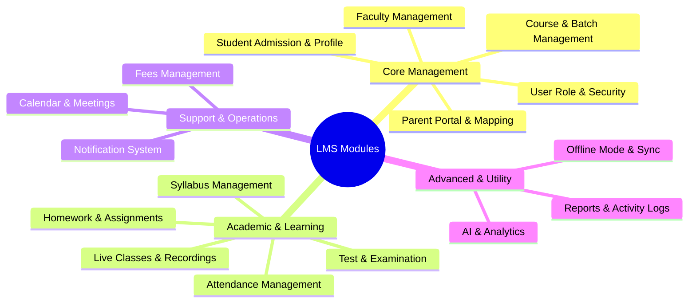

# LMS Module Map

**Project:** Learning Management System (LMS)  
**Document Type:** Module Map and Functional Scope  
**Date:** 29 June 2026  

This document lists and defines the 16 functional modules of the Learning Management System (LMS). It serves as the master map mapping the functional capabilities, primary actors, interfaces, and platforms (Web App, PWA, Mobile App) for each component.

---

## 1. Master Module Overview

The LMS consists of the following modules:

---

## 2. Module Specifications

### 2.1 User, Role & Security (`user_role_security`)
* **Description:** Handles user authentication, session management, multi-role assignment (RBAC), security policies, and OTP verification.
* **Primary Actors:** Admin, Faculty, Student, Parent.
* **Platforms:** Web App, PWA, Mobile App.
* **Core Functions:**
  - Secure Login / Logout (Password and OTP-based).
  - Role-Based Access Control (RBAC) permission configuration.
  - Active session monitoring and token invalidation.
  - Security audit logs and policy configurations (password strength, OTP expiry).

### 2.2 Student Admission & Profile (`student_admission_profile`)
* **Description:** Manages the student lifecycle from the initial inquiry and registration to verification, document uploads, and profile archival.
* **Primary Actors:** Admin, Super Admin.
* **Platforms:** Web App.
* **Core Functions:**
  - Online student registration and admission forms.
  - Profile creation: Personal details, emergency contacts, addresses.
  - Verification document uploads (Aadhaar, Marksheets, Transfer Certificates).
  - Student status tracking (Active, Inactive, Archived, Graduated).

### 2.3 Parent Portal & Mapping (`parent_portal_mapping`)
* **Description:** Connects parents to their child's academic, financial, and attendance records, enabling multi-child toggling and communications.
* **Primary Actors:** Parent.
* **Platforms:** Web App, Mobile App.
* **Core Functions:**
  - Secure parent login and registration linked to student records.
  - Student-Parent relation links (with custom flags like `can_pay_fees`, `receives_notifications`).
  - Multi-child selection dashboard.
  - Notifications view, fee status tracking, and report downloads.

### 2.4 Faculty Management (`faculty_management`)
* **Description:** Manages faculty profile records, qualifications, academic specializations, workload mapping, and batch assignments.
* **Primary Actors:** Admin.
* **Platforms:** Web App.
* **Core Functions:**
  - Faculty profile registration and employee code allocation.
  - Faculty subject specialization and availability mapping.
  - Batch assignment and timetable allocation.
  - Performance tracking (notes uploaded, tests evaluated, attendance marked).

### 2.5 Course & Batch Management (`course_batch_management`)
* **Description:** Configures courses, subjects, batch subdivisions, classroom allocations, timetables, and student enrollment mappings.
* **Primary Actors:** Admin.
* **Platforms:** Web App.
* **Core Functions:**
  - Course creation (departments, durations, academic years).
  - Subject mapping to courses.
  - Batch creation (code generation, capacity limits, start/end dates).
  - Classrooms and timetabling scheduler (with conflict check algorithms).
  - Batch transfers and enrollment history logs.

### 2.6 Attendance Management (`attendance_management`)
* **Description:** Records daily, biometric, or QR-based class attendance. Supports offline registration and automatic server sync.
* **Primary Actors:** Faculty, Student (QR scanning).
* **Platforms:** PWA (Offline), Web App, Mobile App.
* **Core Functions:**
  - Batch-wise daily attendance marking (Present, Absent, Late, Leave).
  - QR Code attendance (generating dynamic tokens, scanning from student device).
  - Absent list alerts (triggers WhatsApp/SMS/Email notifications to parents).
  - Biometric attendance log sync.

### 2.7 Live Classes & Recordings (`live_classes_recordings`)
* **Description:** Coordinates online live lectures through third-party APIs (Zoom, Meet, Teams) and manages archived lecture recordings.
* **Primary Actors:** Faculty, Student.
* **Platforms:** Web App, Mobile App.
* **Core Functions:**
  - Live class scheduling (date, time, platform links, password).
  - One-click "Join Class" buttons for students.
  - Live class attendance logging (joined time, left time, duration).
  - Recording upload and permissions mapping (restricting to specific batches).

### 2.8 Syllabus Management (`syllabus_management`)
* **Description:** Tracks topic-level academic progress, hosts digital unit/chapter notes, and provides completion metrics for admins and students.
* **Primary Actors:** Admin, Faculty, Student.
* **Platforms:** Web App, PWA, Mobile App.
* **Core Functions:**
  - Subject-wise syllabus structure definition (Units -> Chapters -> Topics).
  - Completion status tracking (Mark Topic Completed, actual completion date).
  - Syllabus notes upload (PDF, Video notes, Web links).
  - Completion percentage progress bars for Admin, Faculty, and Student.

### 2.9 Test & Examination (`test_examination`)
* **Description:** Manages the full examination lifecycle: online MCQ tests (with auto-grading), subjective uploads, manual evaluation, and OMR sheet parsing.
* **Primary Actors:** Admin, Faculty, Student.
* **Platforms:** Web App, PWA (offline marks entry), Mobile App.
* **Core Functions:**
  - Test creation (Phases: Primary/Basic, Intermediate/Unit, Advanced/Mock Pattern).
  - Online test engine (timers, auto-submit, question shuffling, MCQ/subjective options).
  - Auto-grading MCQs with negative marking support.
  - Subjective manual evaluation rubrics.
  - OMR scanning and upload processing.
  - Rank generation, topper lists, and weak topic identification mappings.

### 2.10 Homework & Assignments (`homework_assignments`)
* **Description:** Handles assignment issuance, notes distribution, deadlines, student file uploads, and faculty feedback loops.
* **Primary Actors:** Faculty, Student.
* **Platforms:** Web App, Mobile App.
* **Core Functions:**
  - Homework creation (Select batch, subject, set deadline, attach files).
  - Online student submission (upload files, add comments).
  - Grading and feedback portal (marks, rubrics, remarks).
  - Late/pending submission tracking and reminders.

### 2.11 Fees Management (`fees_management`)
* **Description:** Manages fee structures, installments, online payments, pending dues, automated receipts, and GST invoices.
* **Primary Actors:** Admin, Parent, Accountant.
* **Platforms:** Web App, Mobile App.
* **Core Functions:**
  - Fee template creation (Assign by student, course, or batch).
  - Online payment gateway integration (UPI, Card, Net Banking).
  - Partial payment ledgers and automatic outstanding balance calculations.
  - Receipt generation (PDF) and optional GST invoice generation.
  - Payment notifications and late payment reminders.

### 2.12 Notification System (`notification_system`)
* **Description:** Automated and manual multi-channel notification engine (SMS, WhatsApp, Email, In-app alerts) for critical events.
* **Primary Actors:** Admin, Faculty (recipients: Student, Parent).
* **Platforms:** Web App (backend service).
* **Core Functions:**
  - Notification template configuration (placeholders like `{{student_name}}`).
  - Triggered events (Absentee Alert, Fee Due, Results Out, Holiday Notices).
  - Delivery logs tracking (Sent, Delivered, Failed, Retry counts).
  - User notification preferences panel.

### 2.13 Calendar & Meetings (`calendar_meetings`)
* **Description:** Schedules and manages academic events, exam dates, holidays, and Parent-Teacher meetings.
* **Primary Actors:** Admin, Faculty, Parent.
* **Platforms:** Web App, Mobile App.
* **Core Functions:**
  - Unified Academic Calendar view.
  - Parent-Teacher meeting scheduler.
  - Meeting attendee status tracking (Attending, Absent, Remarks).
  - Holiday and event notifications.

### 2.14 Offline Mode & Sync (`offline_mode_sync`)
* **Description:** Caches critical data locally using Service Workers and IndexedDB. Automatically pushes queued changes upon reconnection.
* **Primary Actors:** Faculty, Admin.
* **Platforms:** PWA (Progressive Web App).
* **Core Functions:**
  - Local caching of student lists, syllabus topics, and assigned tests.
  - Offline attendance marking and offline exam marks entry.
  - Local database transaction queue tracking.
  - Auto-sync engine with version check and conflict resolution strategies.

### 2.15 AI & Analytics (`ai_analytics`)
* **Description:** Identifies academic trends, weak topics, and drop-out risks, and drives personalization through automated revision and test recommendations.
* **Primary Actors:** Student, Parent, Faculty, Admin.
* **Platforms:** Web App, Mobile App.
* **Core Functions:**
  - Subject-wise and topic-wise performance score aggregation.
  - Weak Topic Analysis using test question mappings.
  - AI Predictions (predicting student final scores based on historical data).
  - AI Recommendations (recommending specific practice tests, lectures, or topics).
  - AI Chatbot answering questions about schedules, syllabus, and marks.

### 2.16 Reports & Activity Logs (`reports_activity_logs`)
* **Description:** Renders PDF/Excel academic, financial, and operation reports and records system audit trails.
* **Primary Actors:** Admin, Accountant.
* **Platforms:** Web App.
* **Core Functions:**
  - PDF/Excel Report export (Student report cards, monthly attendance, fees collections, pending dues).
  - Asynchronous report generation for large datasets.
  - Complete security audit logs (capturing user, IP, action, entity, old value, new value).
  - Backup & restore utility execution logs.
